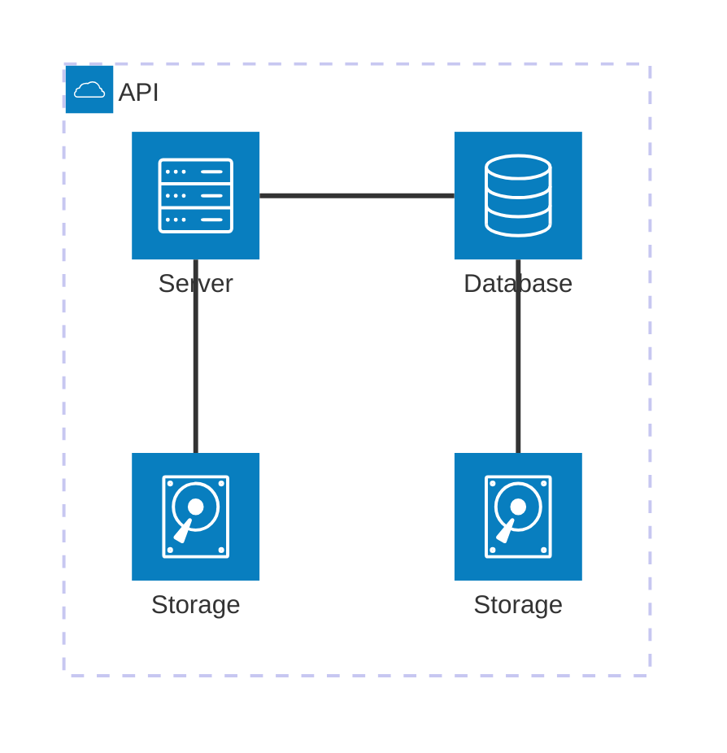

# Architecture Diagram

Official: https://mermaid.js.org/syntax/architecture.html

## When
Cloud / CI-CD style service and resource maps: groups, services, directed edges, junctions (v11.1.0+).

## Keyword
`architecture-beta`

## Syntax

Building blocks: `groups`, `services`, `edges`, `junctions`. Icons in `()`, labels in `[]`. Declare identifiers before use.

### Groups

```
group {group id}({icon name})[{title}] (in {parent id})?
```

```
group public_api(cloud)[Public API]
group private_api(cloud)[Private API] in public_api
```

### Services

```
service {service id}({icon name})[{title}] (in {parent id})?
```

```
service database1(database)[My Database] in private_api
```

### Edges

```
{serviceId}{{group}}?:{T|B|L|R} {<}?--{>}? {T|B|L|R}:{serviceId}{{group}}?
```

| Piece | Meaning |
| --- | --- |
| `:L` `:R` `:T` `:B` | Side the edge leaves/enters |
| `--` | Undirected edge body |
| `-->` / `<--` / `<-->` | Arrows (`<` before left dir, `>` after right) |
| `{group}` after serviceId | Edge out of/into the surrounding group (not a group id) |

```
db:R -- L:server
subnet:R --> L:gateway
server{group}:B --> T:subnet{group}
```

`groupId` cannot be used directly as an edge endpoint; `{group}` only works on services inside a group.

### Junctions

```
junction {junction id} (in {parent id})?
```

4-way split node for edge fan-in/out.

### Align siblings (v11.16.0+)

```
align row {idA} {idB} {idC} ...
align column {idA} {idB} ...
```

Members must already be services or junctions (≥2). Use `align column` when peers share a horizontal port pair (e.g. all `R --> L:x`); use `align row` for a shared vertical port pair (e.g. all `B --> T:x`). Member order sets axis order and must not contradict edges between them.

### Icons

Built-in: `cloud`, `database`, `disk`, `internet`, `server`. Registered Iconify packs use `pack:icon-name` (e.g. `logos:aws-ec2`).

## Example



## Gotchas

- Identifier must be declared before any edge references it.
- Edges use service ids only; use `{group}` modifier for group-boundary edges — never a bare group id.
- `align` order that conflicts with edge directions fails layout (e.g. `a:L --> R:b` then `align row a b`).
- Siblings with identical edge topology can overlap without `align row|column`.
