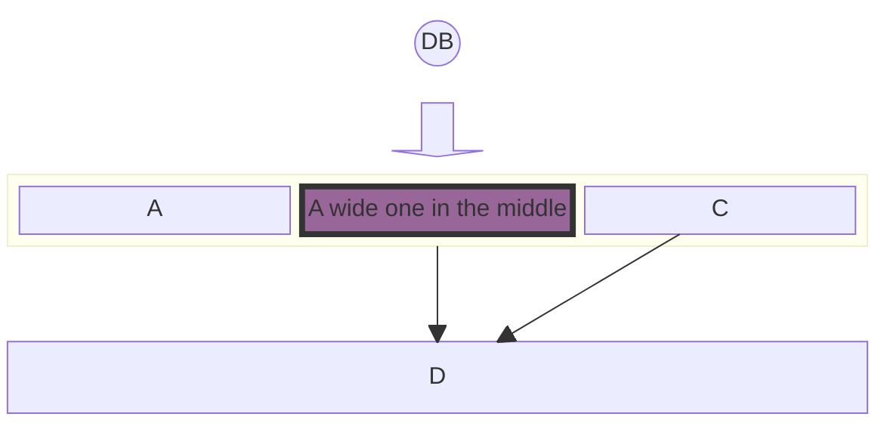

# Block Diagram

Official: https://mermaid.js.org/syntax/block.html

## When
Author-controlled block layouts (columns, spans, nesting) without flowchart auto-layout moving shapes.

## Keyword
`block`

## Syntax

### Layout

| Construct | Meaning |
| --- | --- |
| `columns N` | Arrange following blocks in N columns (wraps) |
| `id:2` | Block spans 2 columns |
| `block` / `block:ID` / `block:ID:2` … `end` | Nested / named composite block |
| `space` / `space:3` | Empty spacer (default width 1) |

```
block
  columns 3
  a["A label"] b:2 c:2 d
```

### Shapes

| Shape | Syntax |
| --- | --- |
| Rectangle (default) | `id` or `id["text"]` |
| Round edges | `id("text")` |
| Stadium | `id(["text"])` |
| Subroutine | `id[["text"]]` |
| Cylinder | `id[("text")]` |
| Circle | `id(("text"))` |
| Double circle | `id((("text")))` |
| Asymmetric | `id>"text"]` |
| Rhombus | `id{"text"}` |
| Hexagon | `id{{"text"}}` |
| Parallelogram | `id[/"text"/]` / `id[\"text"\]` |
| Trapezoid | `id[/"text"\]` / `id[\"text"/]` |

### Block arrows

```
blockArrowId<["Label"]>(right|left|up|down|x|y)
blockArrowId7<["Label"]>(x, down)
```

### Edges

| Form | Meaning |
| --- | --- |
| `A --> B` | Arrow |
| `A -- "X" --> B` | Labeled arrow |

Place linked blocks in the grid first (often with `space` between them); edges do not position boxes.

### Styling

```
style id1 fill:#636,stroke:#333,stroke-width:4px
classDef blue fill:#6e6ce6,stroke:#333,stroke-width:4px;
class A blue
```

## Example



## Gotchas

- Links alone do not place nodes — put blocks (and `space`) in the grid, then add edges (`A - B` is invalid; use `A --> B` with spacing).
- Style properties need CSS form with commas: `style A fill:#969,stroke:#333;` (not `fill#969`).
- Nested composites close with `end`.
