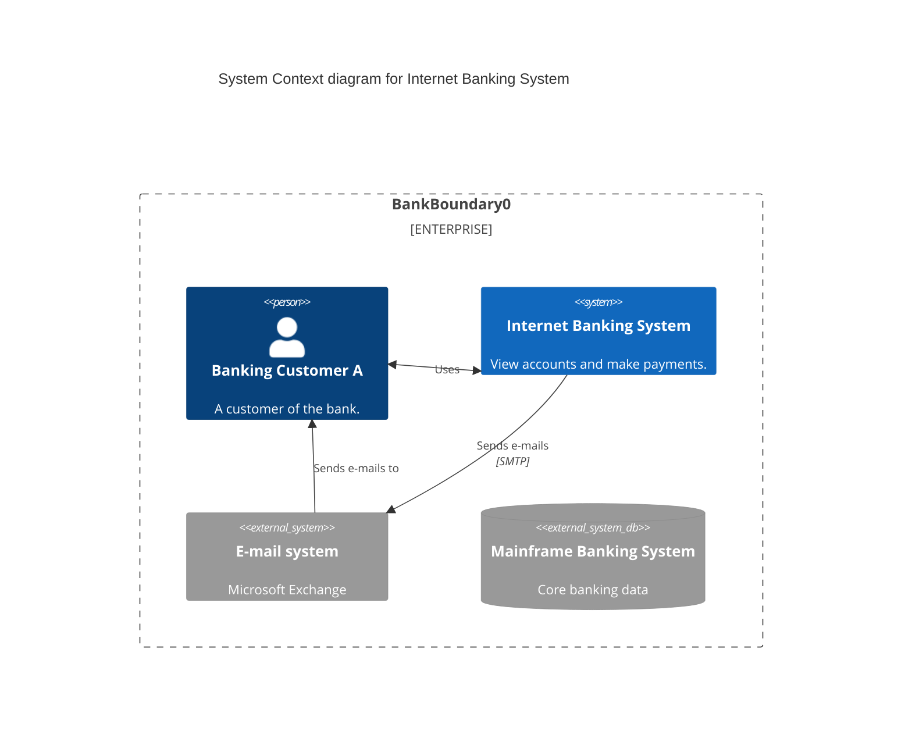

# C4 Diagrams

Official: https://mermaid.js.org/syntax/c4.html

## When
C4 model views: system context, containers, components, dynamic flows, deployments. PlantUML-compatible syntax.

## Keyword
`C4Context` (also `C4Container`, `C4Component`, `C4Dynamic`, `C4Deployment`). Experimental — syntax may change.

| Type | Keyword |
| --- | --- |
| System Context | `C4Context` |
| Container | `C4Container` |
| Component | `C4Component` |
| Dynamic | `C4Dynamic` |
| Deployment | `C4Deployment` |

## Syntax

### Elements (by diagram)

| Diagram | Elements |
| --- | --- |
| Context | `Person`, `Person_Ext`, `System`, `SystemDb`, `SystemQueue`, `System_Ext`, `SystemDb_Ext`, `SystemQueue_Ext`, `Boundary`, `Enterprise_Boundary`, `System_Boundary` |
| Container | `Container`, `ContainerDb`, `ContainerQueue`, `Container_Ext`, `ContainerDb_Ext`, `ContainerQueue_Ext`, `Container_Boundary` (+ context-level systems/persons) |
| Component | `Component`, `ComponentDb`, `ComponentQueue`, `Component_Ext`, `ComponentDb_Ext`, `ComponentQueue_Ext` |
| Dynamic | Same building blocks + `RelIndex(index, from, to, label, ...)` (index ignored; sequence = statement order) |
| Deployment | `Deployment_Node`, `Node`, `Node_L`, `Node_R` |

Typical signatures (optional args with `?`; named args start with `$`):

```
Person(alias, label, ?descr, ?sprite, ?tags, $link)
Container(alias, label, ?techn, ?descr, ?sprite, ?tags, $link)
Component(alias, label, ?techn, ?descr, ?sprite, ?tags, $link)
Deployment_Node(alias, label, ?type, ?descr, ?sprite, ?tags, $link)
```

Boundaries nest with `{ ... }`:

```
Enterprise_Boundary(b0, "Bank") {
  System_Boundary(b1, "App") { ... }
}
```

### Relationships

| Form | Meaning |
| --- | --- |
| `Rel(from, to, label, ?techn, ...)` | Directed |
| `BiRel(from, to, label, ...)` | Bidirectional |
| `Rel_U` / `Rel_Up`, `Rel_D` / `Rel_Down`, `Rel_L` / `Rel_Left`, `Rel_R` / `Rel_Right` | Directional layout hint |
| `Rel_Back` | Reverse direction |

### Layout / style (put near end)

| Call | Purpose |
| --- | --- |
| `UpdateElementStyle(name, $fontColor=..., $bgColor=..., $borderColor=...)` | Element style |
| `UpdateRelStyle(from, to, $textColor=..., $lineColor=..., $offsetX=..., $offsetY=...)` | Rel color + label offset |
| `UpdateLayoutConfig($c4ShapeInRow="3", $c4BoundaryInRow="1")` | Shapes/boundaries per row (defaults 4 / 2) |

Positional or `$named` params both work. Layout is statement-order based — `Lay_*` statements are not supported.

### Not supported (short term)

`sprite`, `tags`, `link`, `Legend`, custom tag/stereotype helpers (`AddElementTag`, `AddRelTag`, shape/line style helpers).

### Wrap (v11.17.1+)

Wrapping on by default; disable with frontmatter `config.c4.wrap: false`.

## Example



## Gotchas

- Experimental; API may change.
- No `Lay_U`/`Lay_D`/`Lay_L`/`Lay_R` — reorder statements / use `UpdateLayoutConfig` instead.
- `RelIndex` ignores the index argument; sequence follows write order.
- Fixed C4 palette; skins do not restyle via CSS themes the usual way.
