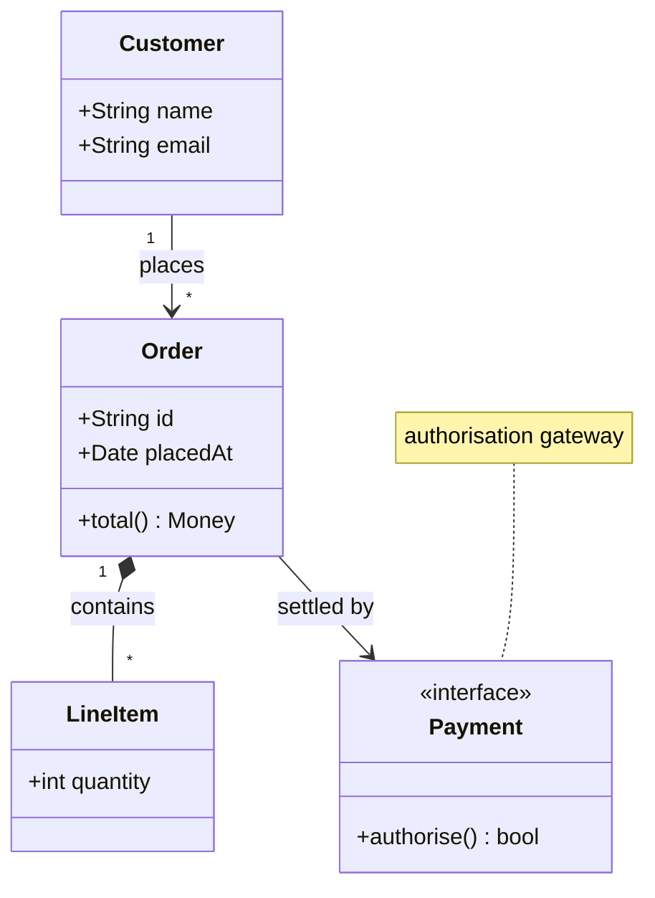

# Class Diagram

Official: https://mermaid.js.org/syntax/classDiagram.html

## When
Static structure: classes, members, and UML relationships (OO / domain models).

## Keyword
`classDiagram`

## Syntax

### Classes & members
```
class Animal
class Animal["Animal with a label"]
class `Animal Class!`
Vehicle <|-- Car
```
Members via `:` or `{}`. Parentheses ⇒ method; otherwise attribute.
```
BankAccount : +String owner
class BankAccount{
    +String owner
    +BigDecimal balance
    +deposit(amount) bool
    +withdrawal(amount) int
}
```
Generics: `~Type~` (e.g. `List~int~`, `Square~Shape~`). Nested `List~List~int~~` ok; commas inside generics not supported. Class name for references drops the generic part.

### Visibility & classifiers
| Mark | Meaning |
|------|---------|
| `+` | Public |
| `-` | Private |
| `#` | Protected |
| `~` | Package/Internal |

Method classifiers after `()` / return type: `*` abstract, `$` static. Field: `$` static at end (`String someField$`).

### Relationships
| Type | Description |
|------|-------------|
| `<\|--` | Inheritance |
| `*--` | Composition |
| `o--` | Aggregation |
| `-->` | Association |
| `--` | Link (solid) |
| `..>` | Dependency |
| `..\|>` | Realization |
| `..` | Link (dashed) |

Labels: `A <|-- B : implements`. Two-way: `Animal <|--|> Zebra` (`[Relation][Link][Relation]`, link `--` or `..`).

Lollipop interface: `bar ()-- foo` / `foo --() bar` (each interface unique).

### Cardinality
Place quoted markers near ends: `Customer "1" --> "*" Ticket`.

| Marker | Meaning |
|--------|---------|
| `1` | Only 1 |
| `0..1` | Zero or one |
| `1..*` | One or more |
| `*` | Many |
| `n` / `0..n` / `1..n` | n-based |

### Annotations
`<<Interface>>`, `<<Abstract>>`, `<<Service>>`, `<<Enumeration>>` — inline, separate line, or inside `{}`.

### Namespace & notes
```
namespace BaseShapes {
    class Triangle
}
namespace Auth["Authentication Service"] { ... }
note "general note"
note for MyClass "class note"
```
Nested namespaces (v11.15.0+): `namespace Company.Engineering.Backend { ... }` or syntactic nesting. Direction: `direction RL`.

Interaction (needs `securityLevel='loose'`): `link Class "url" "tooltip"`, `click Class href "url" "tooltip"`.

Comments: `%%` on their own line.

## Example


## Gotchas
- Class names: alphanumeric, unicode, `_`, `-` only (unless backtick-escaped labels).
- Space required between `)` and return type (`deposit(amount) bool`).
- Generics with commas (e.g. `Map~K,V~`) are not supported.
- Two classes with the same name but different generics are not supported.
- Interaction (`click`/`link`) disabled under `securityLevel='strict'`.
