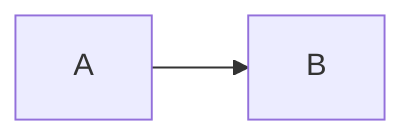
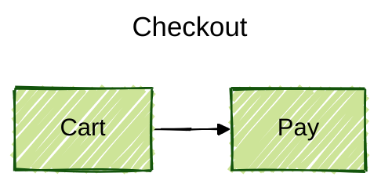

# Mermaid common syntax

Official: https://mermaid.js.org/intro/syntax-reference.html
Config: https://mermaid.js.org/config/configuration.html
Themes: https://mermaid.js.org/config/theming.html

Load this file once per task. Type-specific operators live in the sibling files, not here.

## Shape of a diagram

Every diagram (except optional YAML frontmatter) **starts with a type keyword**, then the contents.

````markdown

````

HTML embed (when not using markdown): `<pre class="mermaid">...</pre>` plus the mermaid JS runtime. See https://mermaid.js.org/config/usage.html.

## Comments

`%%` comments out the rest of the line.

```
%% this is ignored
flowchart LR
  A --> B %% also ignored
```

Do not put `{` `}` inside `%%` comments — that collides with old directive syntax and can break the render.

## Frontmatter (v10.5.0+)

Optional YAML between `---` lines **must** start on line 1. Indentation is significant; misspelled keys are ignored; malformed YAML breaks the diagram.



`title` is diagram metadata. Everything under `config:` is mermaid config. Directives `%%{init: ...}%%` are the older equivalent; prefer frontmatter.

## Themes, look, layout

Set in frontmatter `config:` or `mermaid.initialize()`.

| Key | Values (common) |
|---|---|
| `theme` | `default`, `neutral`, `dark`, `forest`, `base` (customizable), `redux`, `redux-dark`, `redux-color`, `redux-dark-color`, `neo`, `neo-dark` |
| `look` | `classic`, `neo`, `handDrawn` |
| `layout` | `dagre`, `elk` (flowchart/state/class/ER/requirement/usecase/agentflow; build-dependent) |

v12+ per-type defaults (redux-color + neo look): flowchart, sequence, class, state, ER, requirement, usecase, venn, swimlane, agentflow. Other types still default to `default` + `classic`. Override when the host theme needs the older look:

```yaml
---
config:
  theme: default
  look: classic
  layout: dagre
---
```

`theme: base` is the only theme meant to be customized via `config.themeVariables`.

## Characters that break parse

Unknown words fail the parser. Config parameters fail silently.

| Problem | Fix |
|---|---|
| Nested `[]()` `{}` in a label | Wrap the label in quotes: `A["text (with parens)"]` |
| Word `end` in flowchart/sequence | Quote it or change case: `"end"`, `End` |
| `%%{ ... }%%` in a comment | Do not use braces in `%%` comments |
| Special chars in node text | Quotes, or HTML entity form `A["quote:#quot;"]` |

Type-specific breakers stay in that type's file.

## Writing for agents

- One type per fence. Do not concatenate two diagrams.
- IDs: `[A-Za-z][A-Za-z0-9_-]*`. Display text goes in the shape/label, not the id.
- Prefer explicit participants/entities before edges when order matters.
- For preview outside a Mermaid-aware renderer, point at https://mermaid.live.
