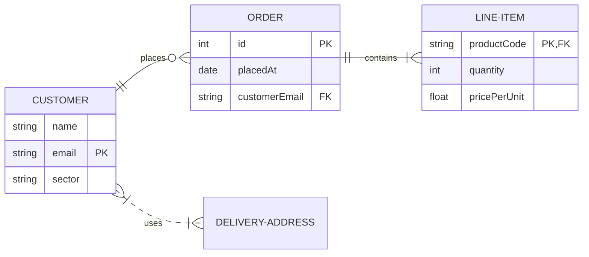

# Entity Relationship Diagram

Official: https://mermaid.js.org/syntax/entityRelationshipDiagram.html

## When
Data models: entities, attributes, and crow's-foot cardinality between them.

## Keyword
`erDiagram`

## Syntax

### Statement form
```
<first-entity> [<relationship> <second-entity> : <relationship-label>]
```
Only `first-entity` is mandatory (orphan entity). If any other part is present, all parts are required. Names may include unicode; quote names with spaces: `"name with space"`.

Alias: `p[Person]` or `a["Customer Account"]` — alias shown instead of the id.

### Cardinality markers
Each end is two characters: outer = max, inner = min.

| Left | Right | Meaning |
|------|-------|---------|
| `\|o` | `o\|` | Zero or one |
| `\|\|` | `\|\|` | Exactly one |
| `}o` | `o{` | Zero or more |
| `}\|` | `\|{` | One or more |

Word aliases (either side): `one or zero` / `zero or one`, `only one` / `1`, `one or more` / `one or many` / `many(1)` / `1+`, `zero or more` / `zero or many` / `many(0)` / `0+`.

### Identifying vs non-identifying
| Marker | Meaning | Line |
|--------|---------|------|
| `--` | Identifying (`to`) | Solid |
| `..` | Non-identifying (`optionally to`) | Dashed |

Examples: `PERSON }|..|{ CAR : "driver"`, `CAR ||--o{ NAMED-DRIVER : allows`, `CAR 1 to zero or more NAMED-DRIVER : allows`.

### Attributes
```
ENTITY {
    type name
    type name PK
    type name FK
    type name UK
    type name PK, FK
    string? middleName
    string driversLicense PK "comment"
}
```
- `type` starts with a letter; may include digits, `-`, `_`, `()`, `[]`.
- `name` similar; leading `*` also marks PK.
- Keys: `PK`, `FK`, `UK` (no markdown/unicode in keys). Multiple: comma-separated.
- Trailing `"comment"` — comments cannot contain `"`.
- Optional types (v11.16.0+): trailing `?` on type (`string?`).

### Direction
`direction TB|BT|LR|RL`

## Example


## Gotchas
- If you start a relationship, label and both entities are all required — incomplete lines fail.
- Attribute comments cannot contain double quotes.
- Key tokens (`PK`/`FK`/`UK`) do not support markdown or unicode.
- Prefer leaving FKs out of logical models; relationships already express association.
