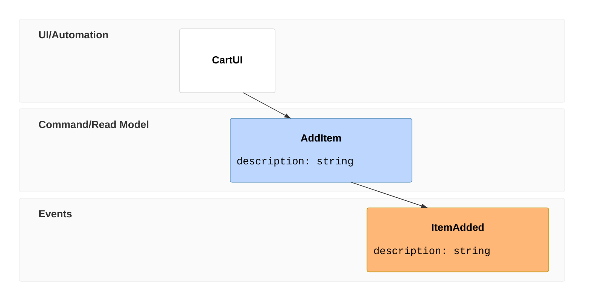

# Event Modeling Diagram

Official: https://mermaid.js.org/syntax/eventmodeling.html

## When
Systems as information over time: UI/processors, commands, read models, events on a timeline.

## Keyword
`eventmodeling`

## Syntax

Compact and relaxed tokens are interchangeable.

| Role | Compact | Relaxed |
| ---- | ------- | ------- |
| Time frame | `tf` | `timeframe` |
| Reset frame | `rf` | `resetframe` |
| UI | `ui` | `ui` |
| Processor | `pcr` | `processor` |
| Command | `cmd` | `command` |
| Read model | `rmo` | `readmodel` |
| Event | `evt` | `event` |

Form: `tf <uniqueId> <kind> <EntityId>` — unique numeric id per frame; order of ids does not matter.

Default swimlanes by kind: UI/Automation (`ui`, `pcr`), Command/Read Model (`cmd`, `rmo`), Events (`evt`). Namespace before `.` in the entity id adds swimlanes, e.g. `Inventory.InventoryChanged`.

| Feature | Form |
| ------- | ---- |
| Inline data | `tf 02 cmd AddItem { description: string }` |
| Data block ref | `tf 02 cmd AddItem [[AddItem01]]` then `data AddItem01 { … }` |
| Typed data | `` `json`{ … } `` (also `jsobj`, `figma`, `salt`, `uri`, `md`, `html`, `text`) |
| Multi-source | `tf 01 rmo CartUI ->> 02 ->> 03` |
| Break inference | `rf` / `resetframe` |

## Example

## Gotchas
- Relations are inferred by default; use `rf`/`resetframe` to break the chain.
- Repeated entities need distinct data-block ids (`AddItem01`, `AddItem02`).
- Data type backticks have no special renderer treatment yet.
