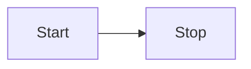
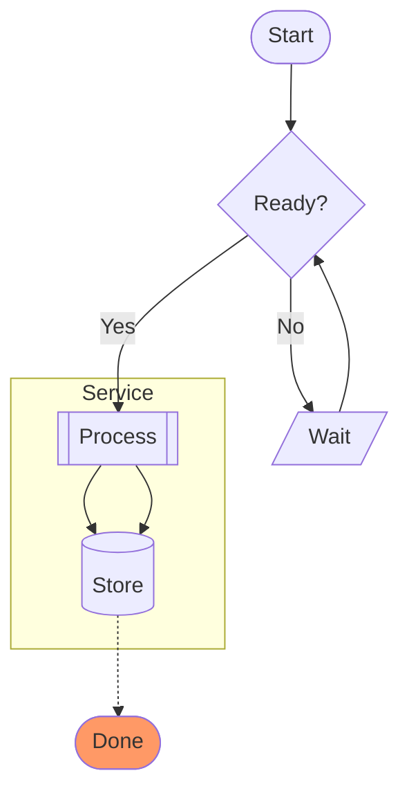

# Flowchart

Official: https://mermaid.js.org/syntax/flowchart.html

## When
Process flows, decisions, and pipelines — general directed graphs of steps/nodes.

## Keyword
`flowchart` (legacy alias: `graph`)

## Syntax

### Direction
| Code | Meaning |
|------|---------|
| `TB` / `TD` | Top to bottom |
| `BT` | Bottom to top |
| `RL` | Right to left |
| `LR` | Left to right |



### Common node shapes
| Shape | Syntax |
|-------|--------|
| Rectangle (default) | `A[text]` |
| Round edges | `A(text)` |
| Stadium | `A([text])` |
| Subroutine | `A[[text]]` |
| Cylinder | `A[(text)]` |
| Circle | `A((text))` |
| Asymmetric | `A>text]` |
| Rhombus | `A{text}` |
| Hexagon | `A{{text}}` |
| Parallelogram | `A[/text/]` / `A[\text\]` |
| Trapezoid | `A[/text\]` / `A[\text/]` |
| Double circle | `A(((text)))` |

Expanded shapes (v11.3.0+): `A@{ shape: NAME }` or `A@{ shape: NAME, label: "text" }`. Useful names: `rect`, `rounded`, `stadium`, `subproc`, `cyl`, `circle`, `diamond`, `hex`, `lean-r`, `lean-l`, `trap-b`, `trap-t`, `dbl-circ`, `doc`, `docs`, `datastore`, `delay`, `fork`. Use `A@{ shape: NAME }` for the rest.

Unicode/special text: quote labels — `id["This ❤ Unicode"]`. Markdown: `id["`**bold** _italic_`"]` (often with `htmlLabels: false`).

### Links
| Syntax | Meaning |
|--------|---------|
| `A --> B` | Arrow |
| `A --- B` | Open link |
| `A -.-> B` | Dotted arrow |
| `A ==> B` | Thick arrow |
| `A --o B` | Circle edge |
| `A --x B` | Cross edge |
| `A ~~~ B` | Invisible link |
| `A o--o B` / `A <--> B` / `A x--x B` | Multi-directional |

Labeled: `A -->|text| B`, `A-- text -->B`, `A-. text .-> B`, `A == text ==> B`.

Chaining: `A --> B --> C`, `A --> B & C --> D`, `A & B --> C & D`.

Extra dashes/dots/`=` lengthen links (`-->` vs `--->`, `-.->` vs `-..->`, `==>` vs `===>`).

Edge IDs: `A e1@--> B` then `e1@{ animate: true }` / `e1@{ animation: fast }`.

### Subgraphs
```
subgraph title
  ...
end
subgraph id [Title]
  ...
end
```
Edges to/from subgraphs work with `flowchart` (not only `graph`). Nested `direction TB|LR|...` is allowed; if any node links outside, subgraph direction is ignored. Collapse (v11.17.0+): `one@{ view: collapsed }` on a subgraph id.

### Styling & interaction
```
classDef name fill:#f9f,stroke:#333,stroke-width:4px;
class nodeId name;
A:::name --> B
style id1 fill:#f9f,stroke:#333,stroke-width:4px
linkStyle 3 stroke:#ff3,stroke-width:4px,color:red;
click nodeId callback "tooltip"
click nodeId "https://example.com" "tooltip"
click nodeId href "https://example.com" "tooltip" _blank
```
Disabled under `securityLevel='strict'`; needs `loose` for click/link.

Comments: `%%` line comments.

## Example


## Gotchas
- Lowercase `end` as node text breaks the chart — use `End`/`END` or quote/workaround.
- Leading `o`/`x` on a connected node id makes a circle/cross edge (`A---oB`); space or capitalize (`A--- Ops`).
- Quote labels that contain `()`, special chars, or ambiguous punctuation.
- `#` starts entity codes in labels (`#quot;`, `#35;` for `#`).
- Subgraph `direction` is ignored when nodes link outside the subgraph.
