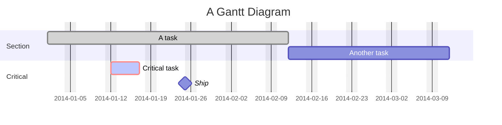

# Gantt Diagram

Official: https://mermaid.js.org/syntax/gantt.html

## When
Project schedules with tasks, durations, dependencies, and milestones over time.

## Keyword
`gantt`

## Syntax

| Construct | Form |
| --------- | ---- |
| Title | `title <text>` |
| Input dates | `dateFormat YYYY-MM-DD` |
| Axis output | `axisFormat %Y-%m-%d` |
| Section | `section <name>` |
| Excludes | `excludes weekends` / day names / `YYYY-MM-DD` |
| Weekend start | `weekend friday` or `weekend saturday` (default Sat–Sun) |
| Tick interval | `tickInterval 1day` / `1week` / … |
| Weekday for ticks | `weekday monday` |
| Today marker | `todayMarker off` or CSS-like styles |
| Comments | `%% ...` |

Task line: `Task title : [tags,] [id,] start, end/length`

| Tag | Meaning |
| --- | ------- |
| `done` | Completed |
| `active` | In progress |
| `crit` | Critical |
| `milestone` | Instant (position ≈ start + duration/2) |
| `vert` | Vertical marker across chart (no row) |

Metadata after optional tags (comma-separated):

| Items | Meaning |
| ----- | ------- |
| `<length>` | Starts after previous task; ends after length |
| `<start>, <end>` or `<start>, <length>` | Explicit start |
| `after <id> [<id2>…], <length\|end>` | Start at latest end of referenced tasks |
| `…, until <id>` | End at start of referenced task (v10.9.0+) |

Duration suffixes: `ms`, `s`, `m`, `h`, `d`, `w`, `M`, `y` (e.g. `3d`, `1.5d`).

Compact mode via frontmatter: `displayMode: compact`.

## Example

## Gotchas
- Tags (`done`/`active`/`crit`/`milestone`) must come first in metadata if used.
- `excludes` accepts dates, weekday names, or `weekends` — not `weekdays`.
- Excluded days inside a task extend the bar rightward (duration preserved); gaps between consecutive tasks stay blank.
- Invalid duration tokens (e.g. `3dX`) yield zero duration.
- Default task start is the end of the preceding task when start is omitted.
