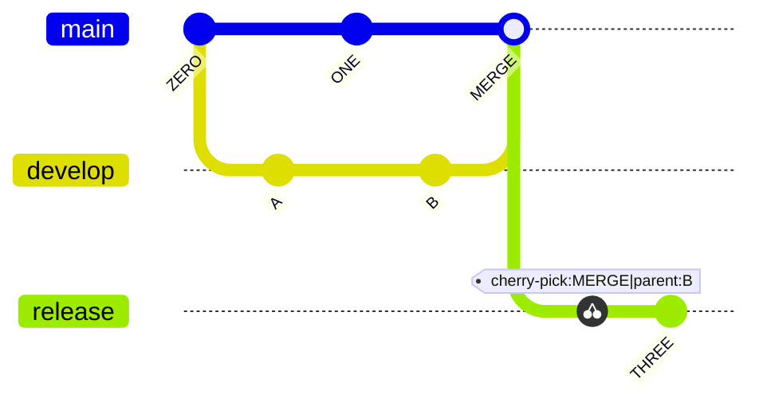

# Git Graph

Official: https://mermaid.js.org/syntax/gitgraph.html

## When
Show git commits and branch operations (branching strategy, merges, cherry-picks).

## Keyword
`gitGraph`

Optional orientation after the keyword: `LR:` (default), `TB:`, `BT:` (v11.0.0+).

## Syntax

### Commands

| Command | Effect |
| --- | --- |
| `commit` | New commit on current branch |
| `branch <name>` | Create and switch to branch |
| `checkout <name>` / `switch <name>` | Switch to existing branch (interchangeable) |
| `merge <name>` | Merge branch into current (merge commit = filled double circle) |
| `cherry-pick id: "..."` | Cherry-pick commit onto current branch |

Default branch is `main` (current until you branch/checkout). Branch names that look like keywords must be quoted: `branch "cherry-pick"`.

### Commit / merge attributes

| Attribute | Syntax | Notes |
| --- | --- | --- |
| Custom id | `commit id: "Alpha"` | Default is random unique id |
| Type | `commit type: NORMAL\|REVERSE\|HIGHLIGHT` | Default `NORMAL` |
| Tag | `commit tag: "v1.0.0"` | Release-style decoration |
| Combined | `commit id: "X" type: HIGHLIGHT tag: "8.8.4"` | Mix freely |
| Merge attrs | `merge develop id: "id" tag: "t" type: REVERSE` | Same attrs as commit |

### Commit types

| Type | Render |
| --- | --- |
| `NORMAL` | Solid circle |
| `REVERSE` | Crossed solid circle |
| `HIGHLIGHT` | Filled rectangle |

### Branch order

```
branch test1 order: 3
```

Precedence: main (`mainBranchOrder`, default `0`) → unordered branches (definition order) → ordered by `order` value.

### Config (`gitGraph` block)

| Option | Default | Notes |
| --- | --- | --- |
| `showBranches` | `true` | Hide branch names/lines if `false` |
| `showCommitLabel` | `true` | Hide commit labels if `false` |
| `mainBranchName` | `"main"` | Rename default branch |
| `mainBranchOrder` | `0` | Position of main among branches |
| `parallelCommits` | `false` | Align commits at same distance from parent |
| `rotateCommitLabel` | `true` | `false` = horizontal labels |

## Example



## Gotchas

- `checkout`/`merge` of a missing branch → console error.
- Cannot merge a branch with itself.
- Cherry-pick requires an existing `id`; commit must not already be on the current branch.
- Current branch needs ≥1 commit before cherry-pick.
- Cherry-picking a merge commit requires `parent: "..."` (immediate parent of that merge).
- Keyword-like branch names must be quoted.
