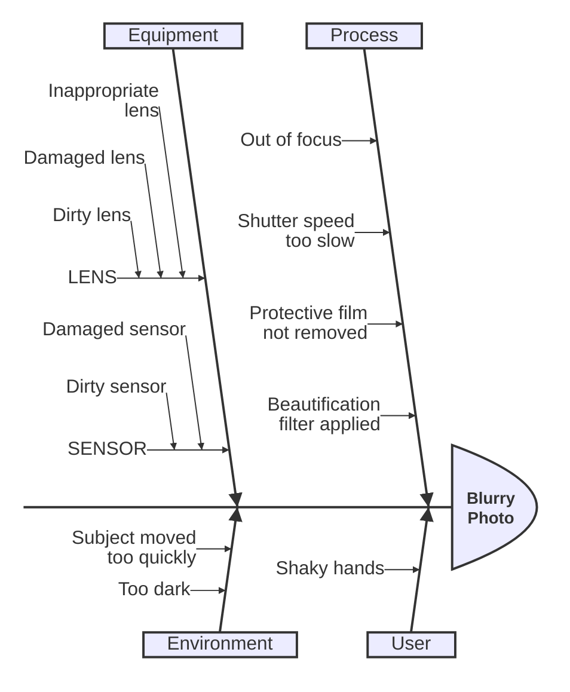

# Ishikawa Diagram

Official: https://mermaid.js.org/syntax/ishikawa.html

## When
Cause-and-effect (fishbone) analysis: one problem/head with indented cause branches.

## Keyword
`ishikawa-beta` (new)

## Syntax

```txt
ishikawa-beta
    <problem / head>
    <cause category>
        <cause>
        <cause>
            <sub-cause>
```

| Rule | Detail |
| ---- | ------ |
| First line after keyword | Event / problem (fish head) |
| Later lines | Causes |
| Indentation | Fishbone hierarchy (deeper = sub-cause) |

No other keywords or edge operators — structure is whitespace only.

## Example



## Gotchas
- Keyword is `ishikawa-beta`; syntax may evolve.
- Indentation defines hierarchy — inconsistent indent breaks the bone structure.
- First content line is always the problem/head, not a category.
