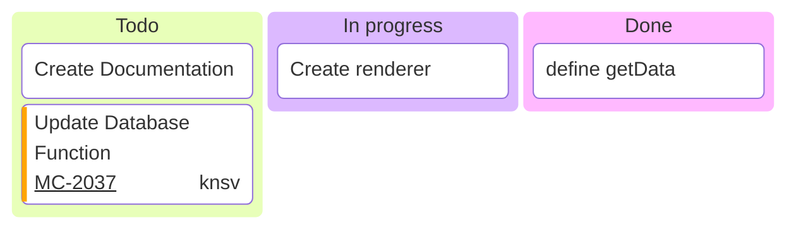

# Kanban Diagram

Official: https://mermaid.js.org/syntax/kanban.html

## When
Tasks moving through workflow columns (Todo / In Progress / Done, etc.).

## Keyword
`kanban`

## Syntax

| Construct | Form |
| --------- | ---- |
| Column | `columnId[Column Title]` |
| Task (indented) | `taskId[Task Description]` under its column |
| Metadata | `taskId[Desc]@{ key: value, … }` |

Tasks **must be indented** under their column.

Supported metadata keys:

| Key | Meaning |
| --- | ------- |
| `assigned` | Who owns the task |
| `ticket` | Ticket/issue id (links if `ticketBaseUrl` set) |
| `priority` | `'Very High'` / `'High'` / `'Low'` / `'Very Low'` |

Config (`config.kanban`):

| Option | Meaning |
| ------ | ------- |
| `ticketBaseUrl` | URL with `#TICKET#` replaced by metadata `ticket` |

Column/task ids should be unique. Title-only forms like `[In progress]` appear in docs as column headers.

## Example

## Gotchas
- Indent tasks under columns; flat lists break structure.
- Use unique ids for columns and tasks.
- `priority` allowed values are only Very High / High / Low / Very Low.
- Ticket links need `ticketBaseUrl` with `#TICKET#` placeholder.
