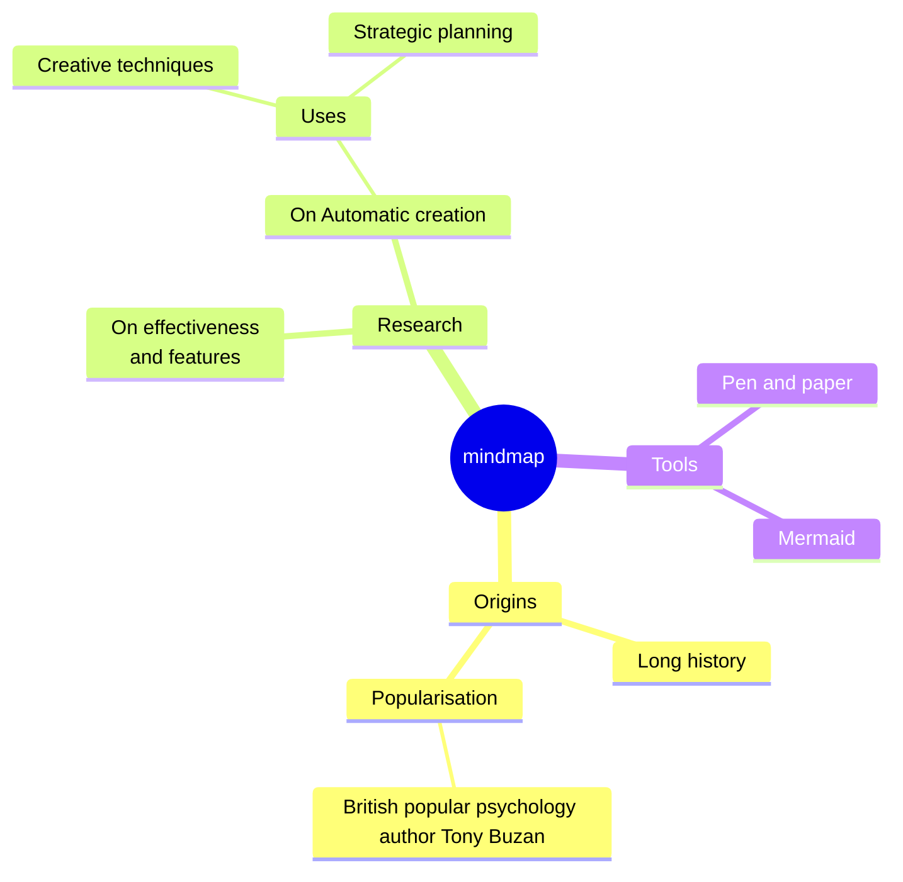

# Mindmap

Official: https://mermaid.js.org/syntax/mindmap.html

## When
Hierarchical idea maps from an indented outline. Experimental overall; icon integration is the unstable part.

## Keyword
`mindmap`

## Syntax

Hierarchy is indentation-only: one root, children indented further than the parent.

```
mindmap
    Root
        A
            B
            C
```

### Node shapes

| Shape | Syntax |
| --- | --- |
| Default | `I am the default shape` |
| Square | `id[I am a square]` |
| Rounded square | `id(I am a rounded square)` |
| Circle | `id((I am a circle))` |
| Bang | `id))I am a bang((` |
| Cloud | `id)I am a cloud(` |
| Hexagon | `id{{I am a hexagon}}` |

Shape syntax mirrors flowcharts where possible (`id` + delimiters + text).

### Icons (experimental)

Place `::icon(classes)` on the line after the node (site must load icon fonts):

```
::icon(fa fa-book)
```

### Classes

Triple colon + space-separated CSS classes on the following line (classes supplied by host):

```
:::urgent large
```

### Markdown strings

Wrap label in `` "`...`" `` for bold (`**`), italics (`*`), newlines, and auto-wrap:

```
id1["`**Root** with
a second line`"]
```

### Unclear indentation

Only relative indent vs previous rows matters. If a node’s indent is between two levels, Mermaid attaches it to the nearest clearer ancestor (often making siblings).

### Layout

Optional tidy-tree via frontmatter:

```
---
config:
  layout: tidy-tree
---
```

## Example



## Gotchas

- Indentation defines parents; messy indents are “fixed” to the nearest clear ancestor — siblings may appear unexpectedly.
- `::icon(...)` / `:::classes` need host-provided fonts/CSS; icons are the experimental piece.
- Markdown labels need the `` "`...`" `` wrapper; plain labels still need `<br/>` for explicit breaks.
