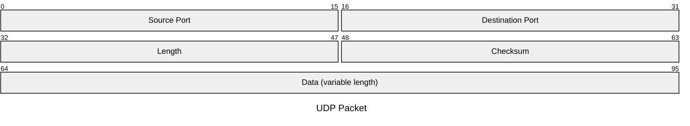

# Packet Diagram

Official: https://mermaid.js.org/syntax/packet.html

## When
Show bit-level structure of a network packet or similar fixed-width binary layout (v11.0.0+).

## Keyword
`packet`

## Syntax

Each field is one line after the keyword (optional `title` via frontmatter or `title` line).

| Form | Meaning |
| --- | --- |
| `start: "name"` | Single-bit field at bit `start` |
| `start-end: "name"` | Multi-bit field from `start` through `end` (inclusive) |
| `+N: "name"` | Next N bits after previous field (v11.7.0+); mixable with absolute ranges |

```
packet
start: "Block name"
start-end: "Block name"
+1: "Block name"
+8: "Block name"
9-15: "Manually set start and end"
```

### Details

- Ranges are bit positions; description is a quoted string.
- Fields are always declared lowest bit first (`0-7`, never `7-0`).
- Default drawing: lowest bit left, highest right. Config `bitOrder: descending` mirrors each row for register-style MSB-left (drawing only).
- Rows wider than `bitsPerRow` (default 32) stack; with descending order each row still mirrors independently.

### Useful config (`packet`)

| Option | Role |
| --- | --- |
| `showBits` | Show bit numbers |
| `bitOrder` | `ascending` (default) or `descending` |
| `bitsPerRow` | Bits per drawn row |

## Example



## Gotchas

- Always declare fields low→high (`0-7`); `bitOrder: descending` only flips drawing.
- Mixing `+N:` and absolute `start-end:` is allowed; absolute ranges do not auto-shift later `+N:` math past a manual jump — place carefully.
- Title may be frontmatter `title:` or a `title ...` line inside the diagram (as in official examples).
