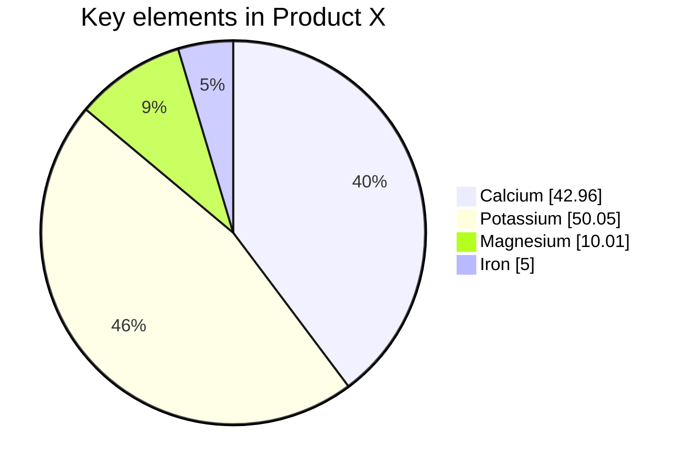

# Pie Chart

Official: https://mermaid.js.org/syntax/pie.html

## When
Show proportions of a whole as slices (optional donut hole).

## Keyword
`pie`

## Syntax

| Part | Form | Required |
| ---- | ---- | -------- |
| Keyword | `pie` | yes |
| Show values | `showData` after `pie` | no |
| Title | `title <text>` | no |
| Slice | `"Label" : <positive number>` | yes (≥1) |

- Labels in `" "` quotes; `:` separates label from value.
- Values: positive numbers greater than zero (up to two decimal places).
- Slices ordered clockwise in declaration order.

Config (YAML frontmatter `config.pie`):

| Parameter | Description | Default |
| --------- | ----------- | ------- |
| `textPosition` | Label position 0.0 (center) → 1.0 (edge) | `0.75` |
| `donutHole` | Hole ratio `0`–`0.9` (v11.16.0+) | `0` |
| `legendPosition` | `top` / `bottom` / `left` / `right` / `center` (v11.16.0+) | `right` |
| `highlightSlice` | Label to highlight, or `'hover'` (v11.16.0+) | |

## Example

## Gotchas
- Values must be **positive and greater than zero**; negatives error.
- `showData` and `title` are optional; slice lines are not.
- Donut/`legendPosition`/`highlightSlice` need Mermaid v11.16.0+.
