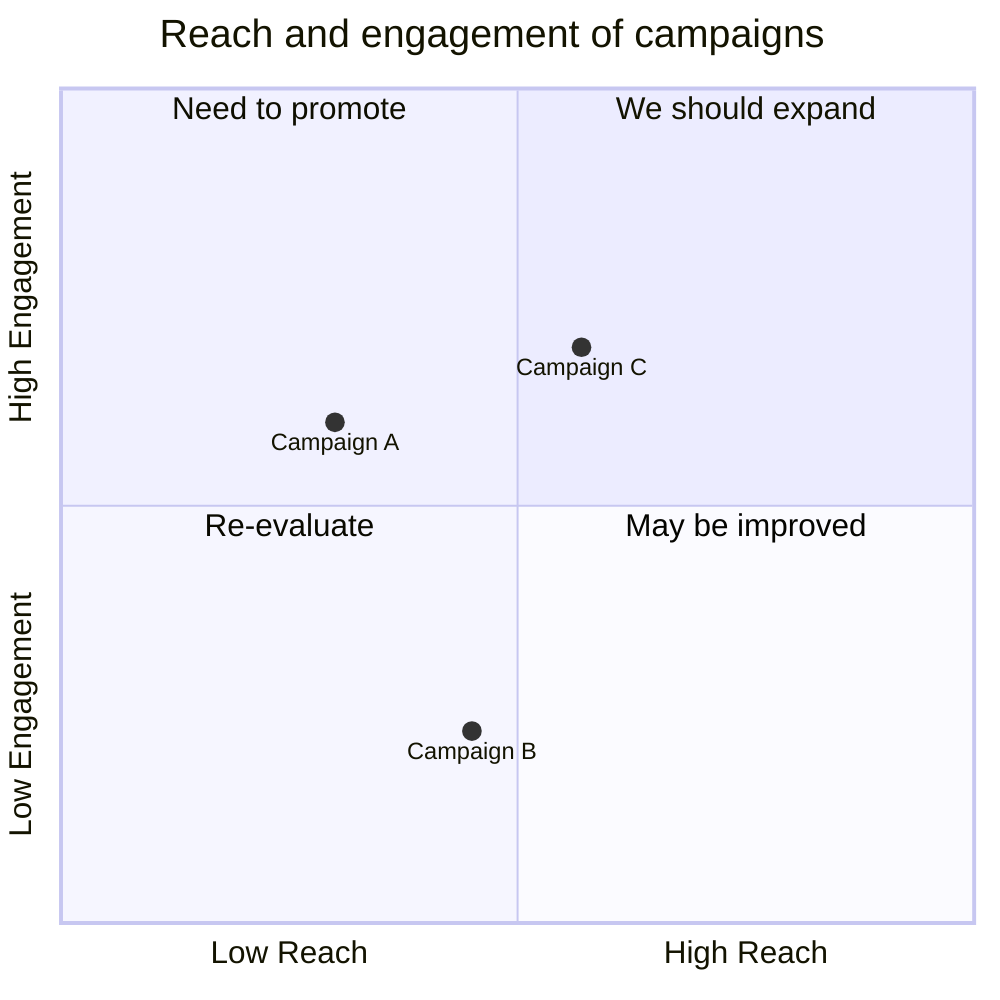

# Quadrant Chart

Official: https://mermaid.js.org/syntax/quadrantChart.html

## When
Plot items on a 2×2 grid (x/y 0–1) with quadrant labels for prioritization.

## Keyword
`quadrantChart`

## Syntax

| Construct | Form |
| --------- | ---- |
| Title | `title <text>` |
| X-axis | `x-axis <left> --> <right>` or `x-axis <left>` only |
| Y-axis | `y-axis <bottom> --> <top>` or `y-axis <bottom>` only |
| Quadrant labels | `quadrant-1` top-right; `quadrant-2` top-left; `quadrant-3` bottom-left; `quadrant-4` bottom-right |
| Point | `<name>: [x, y]` with **x,y in 0–1** |

Point styling (inline after coordinates):

| Style | Example |
| ----- | ------- |
| Direct | `Point A: [0.9, 0.0] radius: 12` |
| Color/stroke | `… color: #ff3300, stroke-color: #10f0f0, stroke-width: 5px` |
| Class | `Point B:::class1: [0.8, 0.1]` + `classDef class1 color: #109060` |

Style preference: direct > class > theme.

## Example

## Gotchas
- Point coordinates must be between **0 and 1** inclusive.
- Without points, axis/quadrant text centers in each quadrant; with points, x labels sit at bottom and quadrant text at top of each cell.
- `stroke-color` alone has no effect unless `stroke-width` is set.
