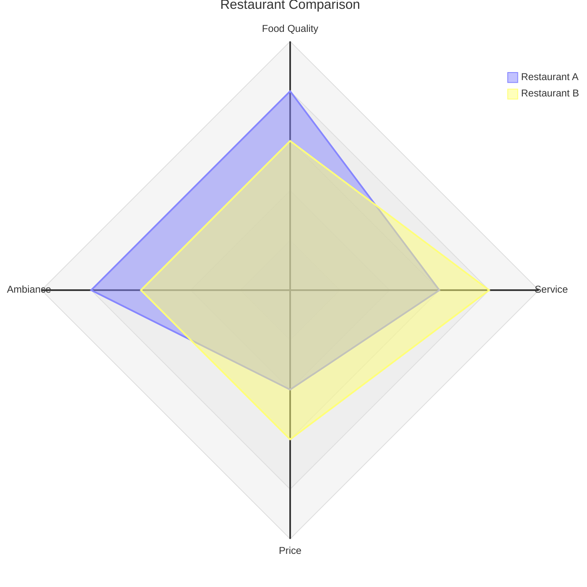

# Radar Diagram

Official: https://mermaid.js.org/syntax/radar.html

## When
Compare entities across multiple dimensions on a circular/spider chart.

## Keyword
`radar-beta`

## Syntax

| Construct | Form |
| --------- | ---- |
| Title | `title <text>` |
| Axis | `axis id["Label"]` — multiple per line, comma-separated |
| Curve | `curve id["Label"]{v1, v2, …}` ordered by axes |
| Curve (keyed) | `curve id{ axisId: val, … }` |
| Legend | `showLegend true` (shown by default) |
| Scale | `max <n>` / `min <n>` (default min `0`; max from data if omitted) |
| Graticule | `graticule circle` or `graticule polygon` (default `circle`) |
| Ticks | `ticks <n>` concentric rings (default `5`) |

Axes: ID plus optional `["Label"]`. Curves: ID, optional label, then `{values}`.

Keyed curve example (order independent):

```
curve id4{ axis3: 30, axis1: 20, axis2: 10 }
```

Options block pattern:

```
showLegend true
max 100
min 0
graticule circle
ticks 5
```

## Example



## Gotchas
- Keyword is `radar-beta`, not `radar`.
- List values must match axis order unless using `axisId: value` pairs.
- Multiple `axis` / `curve` statements allowed; axes can be split across lines.
- Default graticule is `circle`; default ticks is `5`; default min is `0`.
