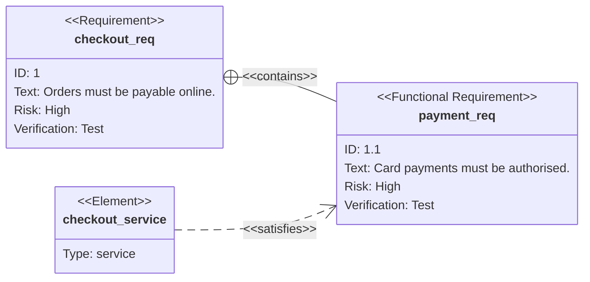

# Requirement Diagram

Official: https://mermaid.js.org/syntax/requirementDiagram.html

## When
SysML-style requirements linked to each other and to documented elements.

## Keyword
`requirementDiagram`

## Syntax

### Requirement
```
<type> user_defined_name {
    id: user_defined_id
    text: user_defined text
    risk: <risk>
    verifymethod: <method>
}
```

| Field | Options |
|-------|---------|
| Type | `requirement`, `functionalRequirement`, `interfaceRequirement`, `performanceRequirement`, `physicalRequirement`, `designConstraint` |
| Risk | `low`, `medium`, `high` (official examples are lowercase) |
| VerificationMethod | `analysis`, `inspection`, `test`, `demonstration` |

Quoted or unquoted user text is allowed; markdown inside quotes works (`"**bold**"`).

### Element
```
element user_defined_name {
    type: user_defined_type
    docref: user_defined_ref
}
```
(`docRef` appears in official examples as an alternate spelling for the document reference field.)

### Relationships
```
{source} - <type> -> {destination}
{destination} <- <type> - {source}
```
Types: `contains`, `copies`, `derives`, `satisfies`, `verifies`, `refines`, `traces`.

### Direction
`direction TB|BT|LR|RL` (`TB` default).

### Styling
```
style test_req fill:#ffa,stroke:#000,color:green
classDef important fill:#f96,stroke:#333,stroke-width:4px
class test_req,test_entity important
requirement test_req:::important { ... }
```
`classDef default ...` applies to all nodes; later styles override.

## Example


## Gotchas
- Unquoted text fails if the parser hits another keyword — quote values when unsure.
- Risk/method values are the enumerated SysML options above (case as documented).
- Relationship endpoints must be names of requirements or elements defined elsewhere.
