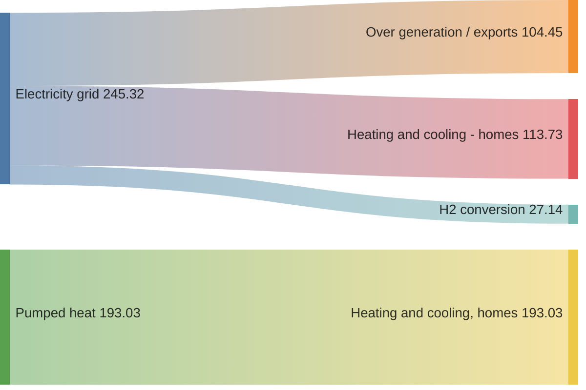

# Sankey Diagram

Official: https://mermaid.js.org/syntax/sankey.html

## When
Show flow volume from sources to targets (experimental CSV-like syntax).

## Keyword
`sankey`

**Experimental** — syntax is CSV-like and may change.

## Syntax

After `sankey`, paste CSV rows. Exactly **3 columns**: `source,target,value`.

| Rule | Detail |
| ---- | ------ |
| Columns | source, target, value only |
| Empty lines | Allowed (no commas needed) for spacing |
| Comma in field | Wrap field in `"..."` |
| Quote in field | Double the quote inside quotes: `"He said ""hi"""` |

Comments with `%%` are fine on their own lines.

Useful config (`config.sankey`):

| Parameter | Values / notes |
| --------- | -------------- |
| `showValues` | Show/hide link values |
| `linkColor` | `source` / `target` / `gradient` / hex e.g. `#a1a1a1` |
| `nodeAlignment` | `justify` / `center` / `left` / `right` |
| `labelStyle` | `legacy` (default) / `outlined` (v11.15.0+) |
| `nodeWidth` / `nodePadding` | Node size/spacing (v11.15.0+) |
| `nodeColors` | Map of node name → CSS color (v11.15.0+) |

## Example

## Gotchas
- Must be exactly three CSV columns per data row.
- Fields containing commas need double quotes.
- Empty lines without commas are allowed (unlike strict RFC CSV).
- Diagram type is experimental; expect syntax extensions.
