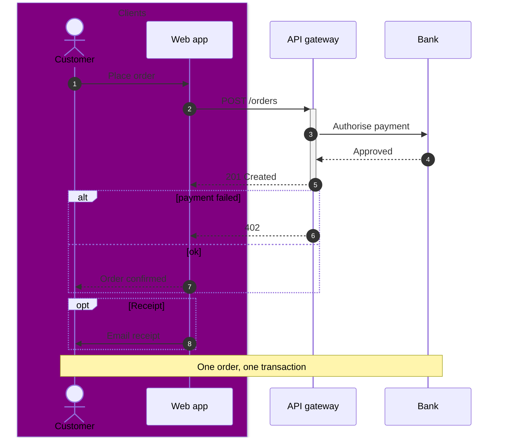

# Sequence Diagram

Official: https://mermaid.js.org/syntax/sequenceDiagram.html

## When
Message order between participants over time — request/response, APIs, protocols.

## Keyword
`sequenceDiagram`

## Syntax

### Participants & actors
```
participant Alice
participant A as Alice
actor Bob
participant API@{ "type": "boundary" } as Public API
```
Types via `@{ "type": "..." }`: `boundary`, `control`, `entity`, `database`, `collections`, `queue`. Alias: `as Label`, or `"alias"` in the JSON object (`as` wins if both set).

Create/destroy (v10.3.0+): only the recipient can be created; either side can be destroyed.
```
create participant Carl
Alice->>Carl: Hi
create actor D as Donald
destroy Carl
```

### Boxes
```
box Purple Alice & John
  participant A
  participant J
end
box rgb(33,66,99)
  participant B
end
box transparent Aqua
  participant C
end
```
Color before optional description. Hex (`#ff0000`) is **not** supported (`#` is comment syntax).

### Arrows
| Type | Meaning |
|------|---------|
| `->` | Solid, no arrowhead |
| `-->` | Dotted, no arrowhead |
| `->>` | Solid arrowhead |
| `-->>` | Dotted arrowhead |
| `<<->>` / `<<-->>` | Bidirectional (v11.0.0+) |
| `-x` / `--x` | Cross at end |
| `-)` / `--)` | Open arrow (async) |

Message form: `Actor Arrow Actor: text`. Line breaks: `<br/>`.

Activations: `activate John` / `deactivate John`, or `->>+John` / `-->>-Alice` (`+/-` suffix). Stackable.

Central connections (v11.12.3+): append `()` — `Alice->>()John: hi`, `Alice()->>John: hi`.

### Notes
```
Note right of John: Text
Note left of Alice: Text
Note over Alice,John: Spanning note
```

### Fragments
```
loop Every minute
  ...
end
alt is sick
  ...
else is well
  ...
end
opt Extra
  ...
end
par Action 1
  ...
and Action 2
  ...
end
critical Establish connection
  ...
option Network timeout
  ...
end
break when booking fails
  ...
end
rect rgb(191, 223, 255)
  ...
end
```

### Autonumber
```
autonumber
autonumber <start> <increment>
```
Also via `mermaid.initialize({ sequence: { showSequenceNumbers: true } })`.

### Links / menus
```
link Alice: Dashboard @ https://example.com/alice
links Alice: {"Dashboard": "https://example.com/alice"}
```

Comments: `%%` on their own line. Entity codes: `#9829;`, `#59;` for `;` in message text.

## Example


## Gotchas
- Lowercase `end` can break the diagram — wrap as `(end)`, `[end]`, `{end}`, or `"end"`.
- Hex box colors unsupported (`#` is comment).
- Semicolons can separate statements; use `#59;` for a literal `;` in messages.
- Create only applies to the message recipient; destroy needs an associated destroying message.
