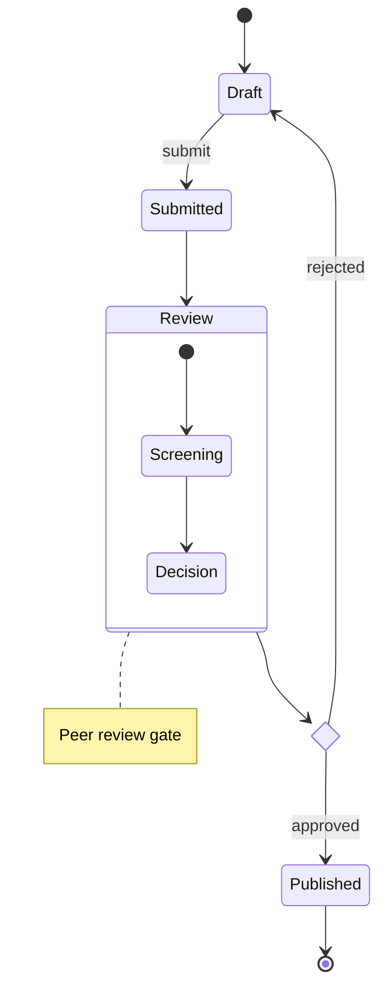

# State Diagram

Official: https://mermaid.js.org/syntax/stateDiagram.html

## When
Finite-state behavior: modes, lifecycles, and transitions between states.

## Keyword
`stateDiagram-v2` (prefer); legacy: `stateDiagram`

## Syntax

### States
```
stateId
state "Description" as s2
s2 : This is a state description
```

### Transitions & start/end
```
s1 --> s2
s1 --> s2: A transition
[*] --> s1
s1 --> [*]
```
`[*]` is start or end depending on arrow direction.

### Composite (nested) states
```
state First {
    [*] --> second
    second --> [*]
}
NamedComposite: Another Composite
state NamedComposite {
    [*] --> namedSimple
}
```
Multiple nesting layers allowed. Transitions between composite states are OK; **not** between internal states of different composites.

### Choice / fork / join
```
state if_state <<choice>>
IsPositive --> if_state
if_state --> False: if n < 0
if_state --> True: if n >= 0

state fork_state <<fork>>
fork_state --> State2
fork_state --> State3
state join_state <<join>>
State2 --> join_state
State3 --> join_state
```

### Concurrency
Inside a composite state, `--` separates concurrent regions:
```
state Active {
    [*] --> NumLockOff
    NumLockOff --> NumLockOn : EvNumLockPressed
    --
    [*] --> CapsLockOff
    CapsLockOff --> CapsLockOn : EvCapsLockPressed
}
```

### Notes
```
note right of State1
    Important information!
end note
note left of State2 : Short note
```

### Direction & styling
```
direction LR
classDef movement font-style:italic;
class Moving, Crash movement
Still --> Moving:::movement
```
`classDef` cannot apply to start/end states, or to/within composite states (except `:::` on transition endpoints including `[*]` in some cases with the `:::` operator).

Spaces in names: define `id: Description` then use `id` in transitions.

Comments: `%%` line comments.

## Example


## Gotchas
- Prefer `stateDiagram-v2` over `stateDiagram`.
- Cannot transition between internal states belonging to different composite states.
- `classDef` cannot target start/end or composite interiors (documented limitation).
- Use `id: label` when state display text needs spaces.
