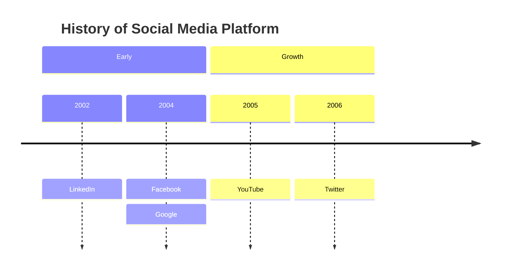

# Timeline Diagram

Official: https://mermaid.js.org/syntax/timeline.html

## When
Chronology of periods and events (experimental; icon integration still experimental).

## Keyword
`timeline`

Optional direction after keyword (v11.14.0+): `timeline LR` (default) or `timeline TD`.

## Syntax

| Construct | Form |
| --------- | ---- |
| Title | `title <text>` |
| Direction | `timeline LR` / `timeline TD` |
| Section | `section <name>` |
| Period + event | `{period} : {event}` |
| Same line multi | `{period} : {event} : {event}` |
| Extra events | Next lines `: {event}` under same period |
| Line break | ` ` in period or event text |

Period and event are plain text (not limited to numbers). First period is leftmost (or top in `TD`); events stack top→bottom per period.

| Direction | Layout |
| --------- | ------ |
| `LR` | Left → right (default) |
| `TD` | Top → down (v11.14.0+) |

Without sections, each period gets its own color by default. Config `timeline.disableMulticolor: true` forces one scheme. Sections share a color within each section.

## Example

## Gotchas
- Always start with `timeline` (optionally `LR`/`TD`).
- Order of periods/events controls layout order.
- Long text wraps by default; use ` ` for forced breaks.
- Experimental overall; icon integration especially may change.
