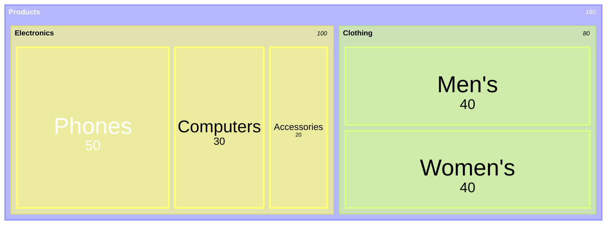

# Treemap Diagram

Official: https://mermaid.js.org/syntax/treemap.html

## When
Hierarchical proportions as nested rectangles (size ∝ value).

## Keyword
`treemap-beta`

**New** — syntax may evolve.

## Syntax

| Construct | Form |
| --------- | ---- |
| Section / parent | `"Name"` |
| Leaf with value | `"Name": <number>` |
| Hierarchy | Indentation (spaces or tabs) |
| Style class | `"Name":::classId` + `classDef classId …` |

Only leaves carry numeric values; parents group children.

Useful config (`config.treemap`):

| Option | Description | Default |
| ------ | ----------- | ------- |
| `showValues` | Show values | `true` |
| `valueFormat` | D3-style format (`,`, `$`, `.1%`, `$0,0`, …) | `,` |
| `padding` | Internal padding between nodes | `10` |
| `diagramPadding` | Outer padding | `8` |

## Example

## Gotchas
- Keyword is `treemap-beta`, not `treemap`.
- Node names are quoted strings; hierarchy is indentation-based.
- Not suited to negative values; very small leaves may be hard to label.
- New diagram type — expect possible syntax changes.
