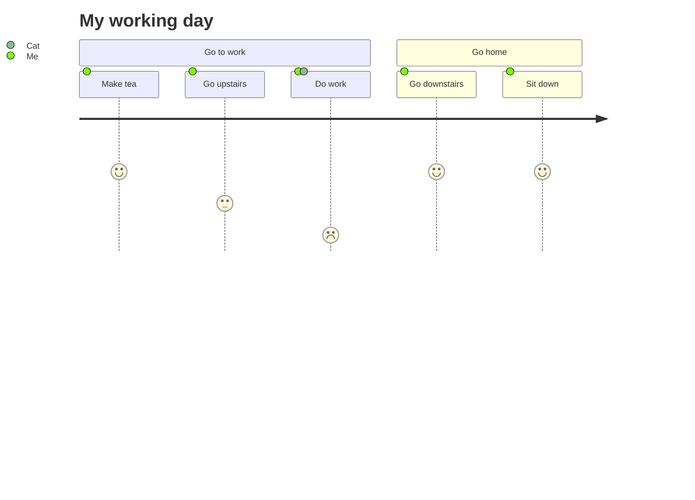

# User Journey Diagram

Official: https://mermaid.js.org/syntax/userJourney.html

## When
Map steps users take to complete a task, with satisfaction scores and actors.

## Keyword
`journey`

## Syntax

| Construct | Form |
| --------- | ---- |
| Title | `title <text>` |
| Section | `section <name>` |
| Task | `Task name: <score>: <actors>` |

Task format: `Task name: <score 1-5>: <comma-separated actors>`

| Field | Rule |
| ----- | ---- |
| Task name | Text before first `:` |
| Score | Integer **1–5** inclusive |
| Actors | Comma-separated list after second `:` |

Sections group steps of the journey (as-is workflow / improvement areas).

Examples of valid task lines:

```
Make tea: 5: Me
Do work: 1: Me, Cat
```

## Example



## Gotchas
- Keyword is `journey`, not `userJourney`.
- Score must be 1–5; format is exactly `name: score: actors`.
- Multiple actors are comma-separated after the score.
- Two colons are required: one after the task name, one after the score.
