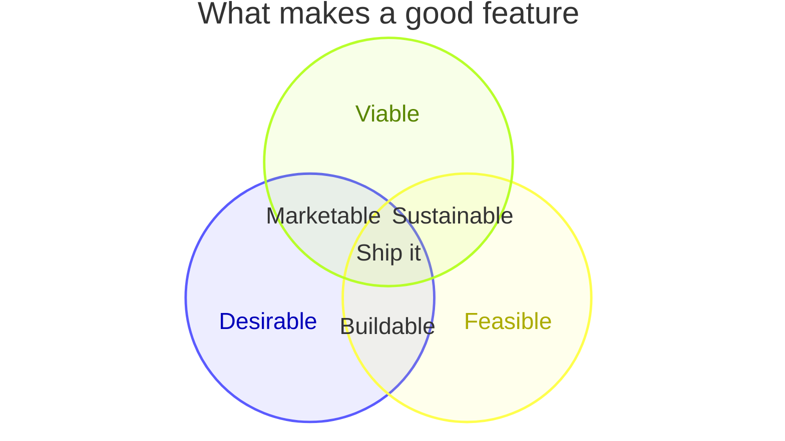

# Venn Diagram

Official: https://mermaid.js.org/syntax/venn.html

## When
Show set membership and overlaps with circles.

## Keyword
`venn-beta`

## Syntax

| Construct | Form |
| --------- | ---- |
| Title | `title <text>` or `title "…"` |
| Set | `set Id` or `set Id["Label"]` or `set "Foo Bar"` |
| Union | `union A,B["Label"]` — 2+ set IDs defined earlier |
| Size | `:N` suffix: `set A["Alpha"]:20` / `union A,B["AB"]:3` |
| Text inside | Indented `text id["Label"]` under a set/union |
| Style | `style A fill:#ff6b6b` / `style A,B color:#333` |

Style props: `fill`, `color`, `stroke`, `stroke-width`, `fill-opacity`.

Identifiers: bare words (`A`, `Set_1`) or quoted (`"Foo Bar"`). Union IDs must already appear in `set` lines. Higher-arity `union` implies pairwise overlaps so the shared region has a place for the label.

With sizes and nested text:

```
set A["Frontend"]:20
  text A1["React"]
set B["Backend"]:12
union A,B["Shared"]:3
  text AB1["OpenAPI"]
style A fill:#ff6b6b
```

## Example



## Gotchas
- Keyword is `venn-beta`, not `venn`.
- Every ID in `union` must be declared with `set` first.
- Indented `text` attaches to the most recent `set` or `union`.
- New diagram type (v11.12.3+); syntax may evolve.
