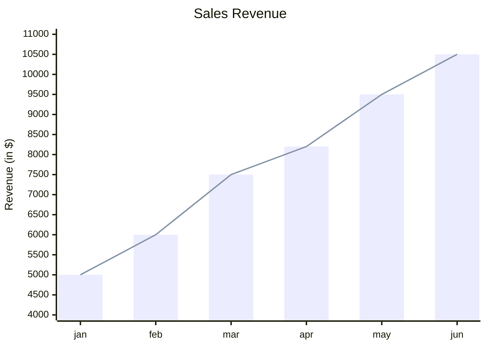

# XY Chart

Official: https://mermaid.js.org/syntax/xyChart.html

## When
Bar and/or line charts on shared x/y axes.

## Keyword
`xychart`

Docs also show `xychart-beta` in the legend example; prefer `xychart` (stable form used throughout the docs). Optional orientation: `xychart horizontal`.

## Syntax

Multi-word text must be in `" "`. Single words may omit quotes.

| Construct | Form |
| --------- | ---- |
| Title | `title "Sales Revenue"` |
| Orientation | `xychart horizontal` (default vertical) |
| Categorical x | `x-axis [jan, feb, "mar apr"]` or `x-axis "title" [...]` |
| Numeric x | `x-axis title min --> max` |
| Y axis | `y-axis "Revenue" 4000 --> 11000` or `y-axis title` (auto range) |
| Bar | `bar [1, 2, 3]` or `bar "name" [1, 2, 3]` |
| Line | `line [1, 2, 3]` or `line "name" [1, 2, 3]` |
| Line point label | `line [540 "PaLM", 65, 7 "Mistral"]` (v11.16.0+) |

Axes optional: omitted ranges are inferred from data. Minimum chart: `xychart` + one `line`/`bar` dataset.

Named `line`/`bar` series appear in the legend (v11.17.0+); unnamed plots are omitted.

Useful config (`config.xyChart`):

| Parameter | Notes | Default |
| --------- | ----- | ------- |
| `showDataLabel` | Values on bars (v11.14.0+) | `false` |
| `showDataLabelOutsideBar` | Labels outside bars | `false` |
| `showLegend` | Named plots | `true` |
| `chartOrientation` | `vertical` / `horizontal` | `vertical` |

## Example

## Gotchas
- Spaces in titles/categories require `"quotes"`.
- Y-axis is numeric only (no categories).
- Point labels work on `line` only; accepted on `bar` but ignored.
- Theme palette key is `themeVariables.xyChart` (camelCase `xyChart`).
