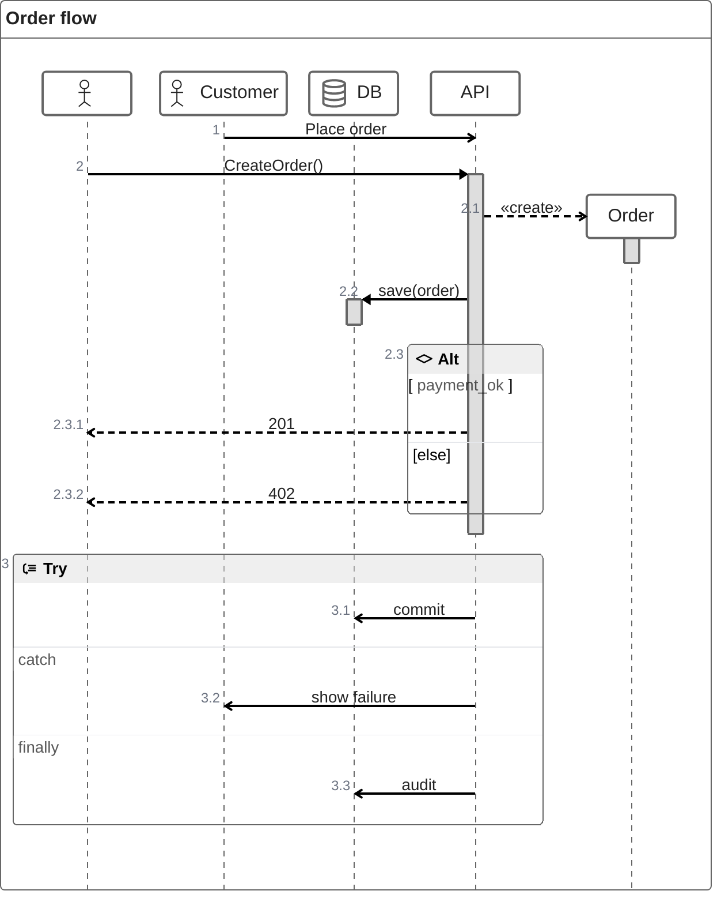

# ZenUML

Official: https://mermaid.js.org/syntax/zenuml.html

## When
Sequence-style interactions with ZenUML syntax (different from `sequenceDiagram`); code-like sync/async nesting.

## Keyword
`zenuml`

## Syntax

### Participants
Implicit from first use, or declare in order:
```
Bob
Alice
Alice->Bob: Hi Bob
```
Annotators: `@Actor Alice`, `@Database Bob` (and other participant annotators supported by ZenUML).

Aliases: `A as Alice`.

Optional `title ...` line.

### Messages
| Kind | Form |
|------|------|
| Sync | `A.SyncMessage` / `A.SyncMessage(with, parameters) { ... }` |
| Async | `Alice->Bob: How are you?` |
| Creation | `new A1` / `new A2(with, parameters)` |
| Reply | `a = A.SyncMessage()`, `SomeType a = A.SyncMessage()`, `return result` inside `{}`, or `@return` / `@reply` on an async message |

Nest sync/creation with `{}`:
```
A.method() {
  B.nested_sync_method()
  B->C: nested async message
}
```

### Comments
`// comment` — rendered above messages/fragments; Markdown supported. Comments on bare participants are ignored.

### Fragments
```
while(condition) { ... }
for(...) { ... }
forEach(...) { ... }   // also foreach
loop(...) { ... }

if(condition1) {
  ...
} else if(condition2) {
  ...
} else {
  ...
}

opt {
  ...
}

par {
  statement1
  statement2
}

try {
  ...
} catch {
  ...
} finally {
  ...
}
```

Integration note: ZenUML may require registering the external diagram package (`@mermaid-js/mermaid-zenuml`) via `mermaid.registerExternalDiagrams`.

## Example


## Gotchas
- Syntax is **not** the same as Mermaid `sequenceDiagram` — do not mix keywords (`participant`, `->>`, `alt`/`end`, etc.).
- ZenUML often needs the external `@mermaid-js/mermaid-zenuml` plugin registered.
- Participant `//` comments are not rendered; message/fragment comments are.
- Control flow uses `if`/`while`/`try` blocks, not `alt`/`loop`/`break`/`end`.
