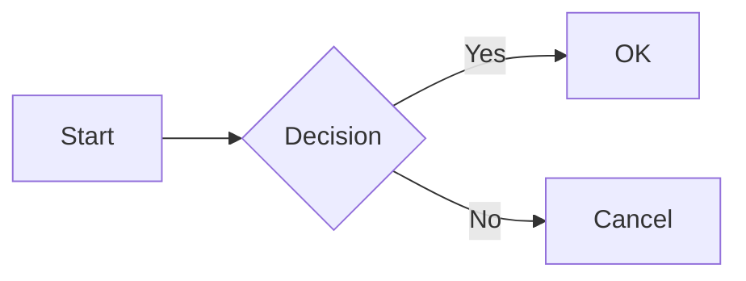
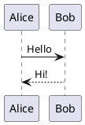

# Slidev API Reference

Comprehensive reference for Slidev frontmatter, layouts, configurations, and features.

## Table of Contents

- [Headmatter Configuration](#headmatter-configuration)
- [Slide Frontmatter](#slide-frontmatter)
- [Built-in Layouts](#built-in-layouts)
- [Code Block Features](#code-block-features)
- [Diagrams & Visualizations](#diagrams--visualizations)
- [Animations & Transitions](#animations--transitions)
- [Themes](#themes)
- [Advanced Features](#advanced-features)

## Headmatter Configuration

The first slide's frontmatter configures the entire presentation.

### Basic Settings

```yaml
---
# Presentation metadata
title: My Presentation
titleTemplate: '%s - Slidev'

# Theme configuration
theme: default
# Available themes: default, seriph, apple-basic, bricks, shibainu, etc.

# Color scheme
colorSchema: auto  # auto | dark | light

# Aspect ratio
aspectRatio: 16/9  # 16/9 | 16/10 | 4/3

# Canvas size
canvasWidth: 980

# Fonts
fonts:
  sans: 'Roboto'
  serif: 'Roboto Slab'
  mono: 'Fira Code'

# Syntax highlighting theme
highlighter: shiki  # shiki | prism
highlighterTheme: nord
# For dual themes (light/dark mode)
highlighterThemeLight: github-light
highlighterThemeDark: github-dark

# Enable/disable features
lineNumbers: false      # Show line numbers in code blocks
download: false         # Enable download as PDF button
exportFilename: slides  # Filename for exports
info: |                # Presenter info (markdown)
  ## My Talk
  By John Doe

# Drawings
drawings:
  enabled: true         # Enable drawing mode
  persist: false        # Persist drawings across reloads
  presenterOnly: false  # Only allow presenter to draw
  syncAll: true         # Sync drawings to all clients

# Monaco editor settings (for editable code blocks)
monaco: true           # Enable Monaco editor
monacoTypesAdditional:
  - npm-package-name

# Background
background: /cover.jpg
# Or use a color: background: '#1e1e1e'

# Remote control
remote: false

# Controls visibility
controls: true
controlsBackBtn: true

# Context menu
contextMenu: true

# Slide transition
transition: slide-left
# Options: slide-left | slide-right | slide-up | slide-down | fade | none

# Recording
record: dev  # dev | build | true | false

# Routing
routerMode: history  # history | hash

# CSS unocss
css: unocss

# Favicon
favicon: /favicon.ico

# Plantex diagram support
plantUmlServer: https://www.plantuml.com/plantuml

# MDC syntax support
mdc: true
---
```

### Export Configuration

```yaml
---
# Export options
export:
  format: pdf
  timeout: 30000
  dark: false
  withClicks: false
  withToc: false
  perSlide:
    pdf:
      printBackground: true
---
```

## Slide Frontmatter

Individual slide configuration (after slide separator `---`).

```yaml
---
# Layout
layout: default
# See "Built-in Layouts" section for all options

# Background
background: /slide-bg.jpg
# Or gradient: background: linear-gradient(to right, #667eea, #764ba2)
# Or color: background: '#42b883'

# Custom CSS classes
class: text-center px-5

# Clicks (animation steps)
clicks: 5

# Notes for presenter
notes: |
  Remember to mention:
  - Key point 1
  - Key point 2

# Hide from table of contents
hideInToc: true

# Disable default layouts
layout: none

# Slide transition (override global)
transition: fade-out

# Enable/disable features for this slide
lineNumbers: true
dragPos:
  square: 691,32,167,_,-16

# Preload images
preload: false

# Zoom level
zoom: 1.5

# Disable slide in production
disabled: false

# Click animations
clicksStart: 0
---
```

## Built-in Layouts

### Standard Layouts

#### `default`
Standard slide with optional header.

```yaml
---
layout: default
---

# Slide Title

Content goes here
```

#### `center`
Vertically and horizontally centered content.

```yaml
---
layout: center
---

# Centered Title
Centered content
```

#### `cover`
First slide / cover page.

```yaml
---
layout: cover
background: /cover.jpg
---

# Presentation Title
## Subtitle

By Author Name
```

#### `intro`
Introduction slide with centered content and metadata.

```yaml
---
layout: intro
---

# Your Name
Your Bio

<div class="absolute bottom-10">
  <span>@ Conference Name</span>
</div>
```

#### `section`
Section divider.

```yaml
---
layout: section
---

# Section Title
```

#### `statement`
Make a statement with large text.

```yaml
---
layout: statement
---

# Bold Statement
```

#### `quote`
Display a quotation.

```yaml
---
layout: quote
---

# "Quote text here"
— Author Name
```

#### `fact`
Present a fact or statistic.

```yaml
---
layout: fact
---

# 95%
User satisfaction rate
```

#### `end`
Ending slide.

```yaml
---
layout: end
---

# Thank You!
Questions?
```

### Multi-Column Layouts

#### `two-cols`
Two-column layout.

```yaml
---
layout: two-cols
---

# Left Column

::right::

# Right Column
```

#### `two-cols-header`
Two columns with header.

```yaml
---
layout: two-cols-header
---

# Header Content

::left::

Left column

::right::

Right column
```

### Image Layouts

#### `image`
Full image background.

```yaml
---
layout: image
image: /path/to/image.jpg
---

# Content over image
```

#### `image-left`
Image on left, content on right.

```yaml
---
layout: image-left
image: /path/to/image.jpg
---

# Content Title
Content here
```

#### `image-right`
Image on right, content on left.

```yaml
---
layout: image-right
image: /path/to/image.jpg
---

# Content Title
Content here
```

#### `iframe`
Embed external website.

```yaml
---
layout: iframe
url: https://example.com
---
```

#### `iframe-left`
Iframe on left, content on right.

```yaml
---
layout: iframe-left
url: https://example.com
---

# Description
Content about the iframe
```

#### `iframe-right`
Iframe on right, content on left.

```yaml
---
layout: iframe-right
url: https://example.com
---

# Description
Content about the iframe
```

## Code Block Features

### Syntax Highlighting

````markdown
```typescript
function hello(name: string): string {
  return `Hello, ${name}!`
}
```
````

### Line Highlighting

````markdown
```typescript {2,4-6}
function example() {
  const highlighted = true  // Line 2 highlighted
  const normal = true
  const rangeStart = true    // Lines 4-6 highlighted
  const rangeMiddle = true
  const rangeEnd = true
}
```
````

### Line Numbers

````markdown
```typescript {1|3|all}
const step1 = true  // Show on click 1
const hidden = true
const step2 = true  // Show on click 2
```
````

### Click Animations in Code

````markdown
```typescript {1|2|3|all}
const first = 1   // Click 1
const second = 2  // Click 2
const third = 3   // Click 3
// All visible on click 4
```
````

### Maximum Lines Display

````markdown
```typescript {maxHeight:'100px'}
// Long code will be scrollable
function veryLongFunction() {
  // ... many lines
}
```
````

### Monaco Editor (Editable)

````markdown
```typescript {monaco}
// This code is editable!
function edit(me: string) {
  console.log(me)
}
```
````

### Multiple Code Snippets

````markdown
```typescript
const typescript = true
```

```python
python = True
```
````

### Code from Files

````markdown
```typescript
<<< @/snippets/example.ts
```
````

### Specific Lines from Files

````markdown
```typescript
<<< @/snippets/example.ts#5-10
```
````

## Diagrams & Visualizations

### Mermaid

````markdown

````

### PlantUML

````markdown

````

### Math (KaTeX)

```markdown
Inline: $E = mc^2$

Block:
$$
\int_0^\infty e^{-x^2} dx = \frac{\sqrt{\pi}}{2}
$$
```

### Charts (Chart.js via plugin)

````markdown
```chart
{
  "type": "bar",
  "data": {
    "labels": ["A", "B", "C"],
    "datasets": [{
      "data": [10, 20, 30]
    }]
  }
}
```
````

## Animations & Transitions

### Click Animations with `v-click`

```markdown
- Item 1
- <v-click>Item 2 (appears on click)</v-click>
- <v-click>Item 3 (appears on click)</v-click>
```

### Click with Index

```markdown
<v-click at="1">Appears at click 1</v-click>
<v-click at="2">Appears at click 2</v-click>
```

### After Click

```markdown
<v-after>Appears after all clicks</v-after>
```

### Click Ranges

```markdown
<v-clicks>

- All items
- In this list
- Appear one by one

</v-clicks>
```

### Motion (Animations)

```markdown
<div v-motion
  :initial="{ x: -80 }"
  :enter="{ x: 0 }">
  Slides in from left
</div>
```

### Slide Transitions

```yaml
---
transition: slide-left  # This slide enters from right
---

# Content

---
transition: fade
---

# Next slide fades in
```

Available transitions:
- `slide-left`, `slide-right`, `slide-up`, `slide-down`
- `fade`
- `zoom`
- `none`

## Themes

### Popular Themes

1. **default** - Clean and minimal
2. **seriph** - Elegant serif design
3. **apple-basic** - Apple keynote style
4. **bricks** - Bricks pattern background
5. **shibainu** - Cute theme
6. **penguin** - Linux theme
7. **geist** - Vercel Geist design
8. **dracula** - Dracula color scheme
9. **eloc** - Technical presentations

### Using Themes

```yaml
---
theme: seriph
---
```

### Installing Additional Themes

```bash
npm install slidev-theme-theme-name
```

Then:
```yaml
---
theme: theme-name
---
```

### Custom Theme

Create `./theme/` directory with:
- `layouts/` - Custom layouts
- `components/` - Vue components
- `styles/` - CSS/SCSS files
- `setup/` - Setup scripts

## Advanced Features

### Components

```markdown
<Tweet id="1234567890" />

<YouTube id="dQw4w9WgXcQ" />

<Counter :count="10" />
```

### Presenter Notes

```yaml
---
# Visible in presenter mode only
notes: |
  Talk about:
  - Point 1
  - Point 2
---
```

Or inline:

```markdown
<!-- This is a note -->
```

### Two-Slide Layout

```markdown
---
layout: two-cols
---

<template v-slot:default>
Left content
</template>

<template v-slot:right>
Right content
</template>
```

### Custom Styles

Per-slide styles:

```markdown
<style>
h1 {
  color: red;
}
</style>

# Red Title
```

Global styles in `./styles/index.css`.

### LaTeX Support

```yaml
---
# In headmatter
katex:
  macros:
    "\\RR": "\\mathbb{R}"
---
```

Then use:
```markdown
$\RR$ for real numbers
```

### Icons

Using UnoCSS icons:

```markdown
<carbon-logo-github /> GitHub

<mdi-check /> Checkmark

<twemoji-flag-japan /> Flag
```

### Embedding Videos

```markdown
<video controls>
  <source src="/video.mp4" type="video/mp4">
</video>
```

### Table of Contents

```markdown
<Toc />
```

With customization:
```markdown
<Toc minDepth="1" maxDepth="3" />
```

### Recording

```yaml
---
record: true
---
```

Start presentation and use controls to record.

### PDF Export

```bash
npm run export

# With options
npm run export -- --output slides.pdf
npm run export -- --dark
npm run export -- --with-clicks
```

### SPA Export

```bash
npm run build

# Output in dist/
```

### Global Layers

Create `./global-top.vue` or `./global-bottom.vue` to add persistent elements.

### Setup Scripts

Create `./setup/main.ts` for Vue app configuration:

```typescript
import { defineAppSetup } from '@slidev/types'

export default defineAppSetup(({ app, router }) => {
  // Configure Vue app
})
```

### Shortcuts

In presentation mode:

- `f` - Fullscreen
- `o` - Overview
- `d` - Dark mode
- `g` - Go to slide
- `c` - Camera/recording
- Arrow keys - Navigate
- Space - Next slide

## Configuration File

Create `slidev.config.ts` for advanced settings:

```typescript
import { defineConfig } from '@slidev/cli'

export default defineConfig({
  title: 'My Presentation',
  themeConfig: {
    primary: '#5d8392'
  },
  fonts: {
    sans: 'Roboto',
    mono: 'Fira Code'
  }
})
```

## Resources

- Official Docs: https://sli.dev
- Theme Gallery: https://sli.dev/themes/gallery
- GitHub: https://github.com/slidevjs/slidev
- Discord Community: https://chat.sli.dev
