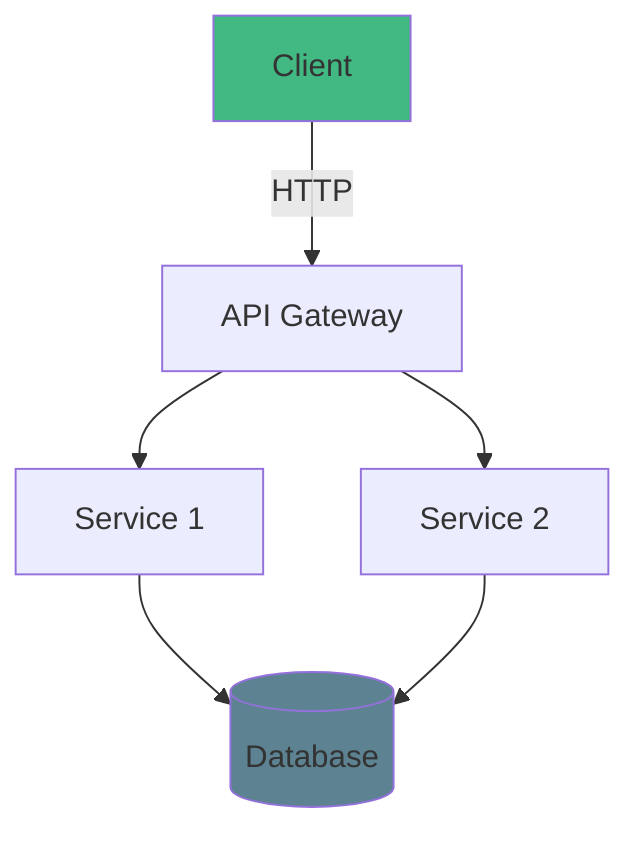
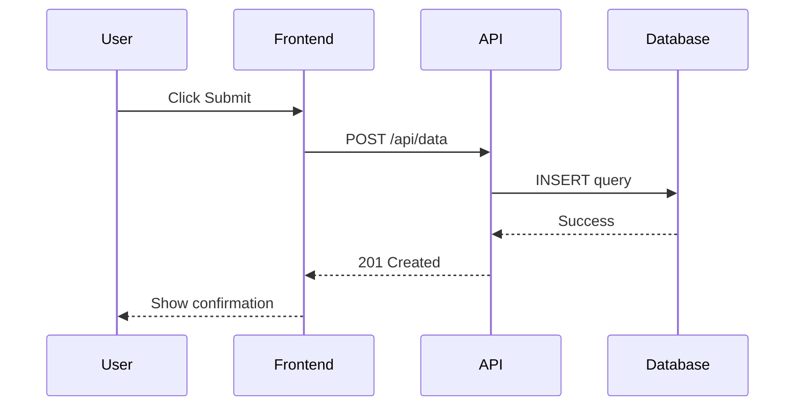

# Technical Presentation

Deep Dive into [Technology Name]

<div class="pt-12">
  <span @click="$slidev.nav.next" class="px-2 py-1 rounded cursor-pointer" hover="bg-white bg-opacity-10">
    Let's get started <carbon:arrow-right class="inline"/>
  </span>
</div>

---
layout: default
---

# Agenda

<Toc></Toc>

---
layout: section
---

# Introduction

## What and Why?

---

# The Problem

Current challenges and pain points

<v-clicks>

- Problem 1: Inefficient workflows
- Problem 2: Scalability issues
- Problem 3: Developer experience
- Problem 4: Performance bottlenecks

</v-clicks>

<div v-click class="mt-8 p-4 bg-orange-500 bg-opacity-10 rounded">

**Key insight:** Traditional approaches don't scale well

</div>

---

# The Solution

How we solve these challenges

```typescript {all|1-2|4-8|10-14|all}
// Type-safe configuration
interface Config {
  host: string
  port: number
  features: {
    caching: boolean
    logging: boolean
  }
}

// Implementation with full type safety
const config: Config = {
  host: 'localhost',
  port: 3000,
  features: { caching: true, logging: true }
}
```

<arrow v-click="3" x1="400" y1="350" x2="230" y2="310" color="#953" width="2" arrowSize="1" />

---
layout: two-cols
---

# Architecture Overview

Modern, scalable design

::left::

## Frontend
- React/Vue
- TypeScript
- Vite

## Backend
- Node.js
- Express
- PostgreSQL

::right::



---

# Code Example: Main Function

Real-world implementation

```typescript {1-3|5-10|12-17|all} {maxHeight:'400px'}
import { createServer } from 'http'
import { parse } from 'url'
import next from 'next'

const dev = process.env.NODE_ENV !== 'production'
const hostname = 'localhost'
const port = 3000

const app = next({ dev, hostname, port })
const handle = app.getRequestHandler()

app.prepare().then(() => {
  createServer(async (req, res) => {
    const parsedUrl = parse(req.url!, true)
    await handle(req, res, parsedUrl)
  }).listen(port)
  console.log(`> Ready on http://${hostname}:${port}`)
})
```

---

# Editable Code Demo

Try it yourself! (Monaco editor)

```typescript {monaco}
// Edit this code and see results!
function fibonacci(n: number): number {
  if (n <= 1) return n
  return fibonacci(n - 1) + fibonacci(n - 2)
}

// Calculate fibonacci sequence
for (let i = 0; i < 10; i++) {
  console.log(`fib(${i}) = ${fibonacci(i)}`)
}
```

<div v-click class="mt-4 p-3 bg-yellow-500 bg-opacity-10 rounded">

**Note:** This code is editable in presentation mode!

</div>

---

# Data Flow Diagram

Visualizing the system architecture



---

# Performance Comparison

Mathematical analysis of complexity

<div class="grid grid-cols-2 gap-4">

<div>

## Time Complexity

Naive approach: $O(n^2)$

$$
T(n) = \sum_{i=1}^{n} \sum_{j=1}^{n} c = cn^2
$$

</div>

<div>

## Optimized

Our approach: $O(n \log n)$

$$
T(n) = n \cdot \log_2 n
$$

**Result:** 100x faster for large datasets!

</div>

</div>

---

# Benchmark Results

Performance metrics across different scenarios

| Scenario | Before | After | Improvement |
|----------|--------|-------|-------------|
| Small (n=100) | 45ms | 12ms | 73% faster |
| Medium (n=1000) | 890ms | 89ms | 90% faster |
| Large (n=10000) | 12.4s | 1.1s | 91% faster |

<div v-click class="mt-8 text-center text-2xl text-green-500">

Average improvement: **85% faster** ⚡

</div>

---

# API Design

Clean and intuitive interface

<div class="grid grid-cols-2 gap-4">

<div>

```typescript
// Simple usage
import { Client } from 'our-sdk'

const client = new Client({
  apiKey: process.env.API_KEY
})

// Fetch data
const data = await client
  .users()
  .list({ limit: 10 })

console.log(data)
```

</div>

<div v-click>

```typescript
// Advanced features
const result = await client
  .users()
  .filter({ active: true })
  .sort('created_at', 'desc')
  .paginate({ page: 1, size: 20 })
  .include(['posts', 'comments'])
  .execute()

// Type-safe results
result.data.forEach(user => {
  console.log(user.name)
})
```

</div>

</div>

---
layout: section
---

# Live Demo

## See It In Action

---
layout: center
---

# Demo Time

<div class="text-6xl">🚀</div>

<div class="mt-8">

[Launch Demo](https://demo.example.com) or run locally:

```bash
npm install
npm run dev
```

</div>

---

# Key Features

What makes this solution special

<v-clicks>

- ✅ **Type Safety** - Full TypeScript support
- ⚡ **Performance** - Optimized for speed
- 🔒 **Security** - Built-in best practices
- 📦 **Zero Config** - Works out of the box
- 🎨 **Customizable** - Flexible configuration
- 📚 **Well Documented** - Comprehensive guides

</v-clicks>

---

# Integration Example

How to integrate into your existing project

<div class="grid grid-cols-2 gap-4">

<div>

### Step 1: Install

```bash
npm install our-package
# or
pnpm add our-package
```

### Step 2: Configure

```typescript
// config.ts
export default {
  apiUrl: 'https://api.example.com',
  timeout: 5000
}
```

</div>

<div>

### Step 3: Use

```typescript
import { init } from 'our-package'
import config from './config'

const api = init(config)

// Start using immediately
const result = await api.fetch()
```

### Step 4: Enjoy!

That's it! You're ready to go.

</div>

</div>

---

# Best Practices

Recommendations for optimal usage

1. **Always use TypeScript** for type safety
2. **Enable caching** for better performance
3. **Handle errors gracefully** with try-catch
4. **Use environment variables** for configuration
5. **Monitor performance** with built-in metrics
6. **Keep dependencies updated** regularly

<div v-click class="mt-8 p-4 bg-blue-500 bg-opacity-10 rounded">

Pro tip: Check out our [Best Practices Guide](https://docs.example.com/best-practices) for more details

</div>

---
layout: section
---

# Results & Impact

## Real-World Success Stories

---

# Case Study: Company X

Production deployment results

<div class="grid grid-cols-3 gap-4 mt-8">

<div v-click class="text-center p-4 bg-green-500 bg-opacity-10 rounded">

### Response Time
<div class="text-4xl font-bold text-green-500">-60%</div>
From 500ms to 200ms

</div>

<div v-click class="text-center p-4 bg-blue-500 bg-opacity-10 rounded">

### Server Costs
<div class="text-4xl font-bold text-blue-500">-40%</div>
Reduced infrastructure

</div>

<div v-click class="text-center p-4 bg-purple-500 bg-opacity-10 rounded">

### Developer Time
<div class="text-4xl font-bold text-purple-500">-50%</div>
Faster development

</div>

</div>

---

# Roadmap

What's coming next

<v-clicks>

- Q1 2025: Advanced caching strategies
- Q2 2025: Real-time collaboration features
- Q3 2025: Plugin ecosystem
- Q4 2025: Enterprise features & SSO

</v-clicks>

<div v-click class="mt-8">

Want to contribute? Check out our [GitHub repo](https://github.com/yourusername/project)

</div>

---

# Resources

Where to learn more

- 📖 **Documentation:** [docs.example.com](https://docs.example.com)
- 🐙 **GitHub:** [github.com/yourusername/project](https://github.com/yourusername/project)
- 💬 **Discord:** [discord.gg/community](https://discord.gg/community)
- 🐦 **Twitter:** [@yourproject](https://twitter.com/yourproject)
- 📺 **YouTube:** [Video Tutorials](https://youtube.com/@yourproject)

---
layout: center
class: text-center
---

# Questions?

<div class="mt-8 text-2xl">

Feel free to ask anything!

</div>

<div class="mt-12">

📧 your.email@example.com

</div>

---
layout: end
---

# Thank You!

Let's stay in touch

<div class="abs-br m-6 flex gap-2">
  <a href="https://github.com/yourusername" target="_blank" class="text-xl slidev-icon-btn opacity-50">
    <carbon-logo-github />
  </a>
  <a href="https://twitter.com/yourusername" target="_blank" class="text-xl slidev-icon-btn opacity-50">
    <carbon-logo-twitter />
  </a>
</div>
