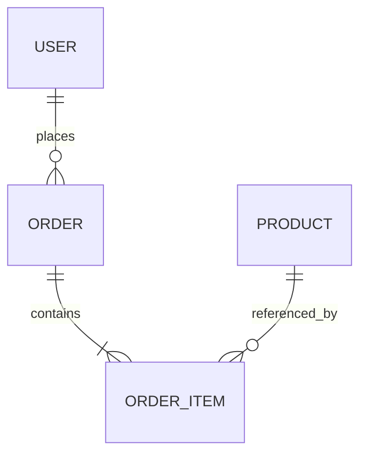

# Data Spec Template

```markdown
---
title: {Data Model Name}
type: data
status: draft
author: {author}
created: {YYYY-MM-DD}
related: []
---

# {Data Model Name} Data Specification

## 1. Overview

### 1.1 Purpose / Scope
{Business domain this data model covers}

### 1.2 Glossary

## 2. ER Diagram



## 3. Entity Definitions

### 3.1 {entity_name}

**Description**: {What this entity represents}

**Columns**

| Column | Type | NULL | Default | Constraints | Description |
|--------|------|------|---------|-------------|-------------|
| id | UUID | NOT NULL | gen_random_uuid() | PK | Primary key |
| name | VARCHAR(100) | NOT NULL | - | UNIQUE | Name |
| created_at | TIMESTAMPTZ | NOT NULL | now() | - | Created at |
| updated_at | TIMESTAMPTZ | NOT NULL | now() | - | Updated at |

**Indexes**
| Name | Columns | Type | Purpose |
|------|---------|------|---------|
| idx_xxx_name | name | btree | Name search |

**Constraints / Business Rules**
- {Unique constraints, check constraints, triggers}
- {Invariants: e.g., amount must be >= 0}

## 4. Relationships

| Parent | Child | Cardinality | Deletion Policy |
|--------|-------|-------------|-----------------|
| USER | ORDER | 1:N | CASCADE / RESTRICT / SET NULL |

## 5. Data Lifecycle

| Entity | Created When | Updated When | Deletion Policy | Retention Period |
|--------|-------------|-------------|-----------------|------------------|
| {} | {} | {} | Soft / Hard delete | {period} |

## 6. Non-Functional Requirements

### 6.1 Performance
- Expected record count (initial / 1yr / 3yr)
- Expected query patterns and QPS
- Index strategy

### 6.2 Security / Privacy
- PII fields: {list}
- Encryption (at rest / in transit)
- Access control (RLS / application layer)
- Masking / anonymization policy

### 6.3 Consistency
- Transaction boundaries
- Uniqueness guarantees
- Consistency check schedule

### 6.4 Backup / Recovery
- Backup frequency and retention
- RPO / RTO

### 6.5 Archive / Deletion
- Archive conditions
- Deletion conditions / GDPR and legal requirements

## 7. Migration Plan
- Data migration strategy (if migrating from existing system)
- Downtime expectations
- Rollback strategy

## 8. Edge Cases
- Concurrent update conflict resolution (optimistic/pessimistic locking)
- Large batch insert performance
- Encoding / charset issues
- Timezone handling
- null vs empty string conventions

## 9. Acceptance Criteria
- Schema can be applied via migration
- Key queries complete within target latency
- Storage is within acceptable limits at expected record counts

## 10. Risks / Open Questions

## 11. Change History
```