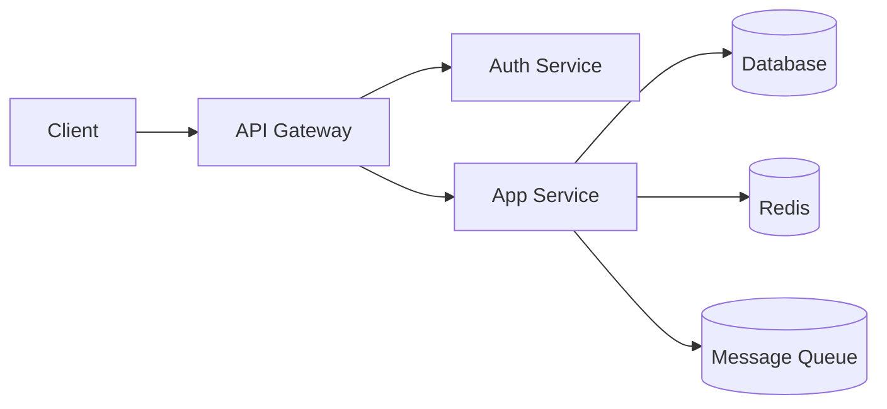
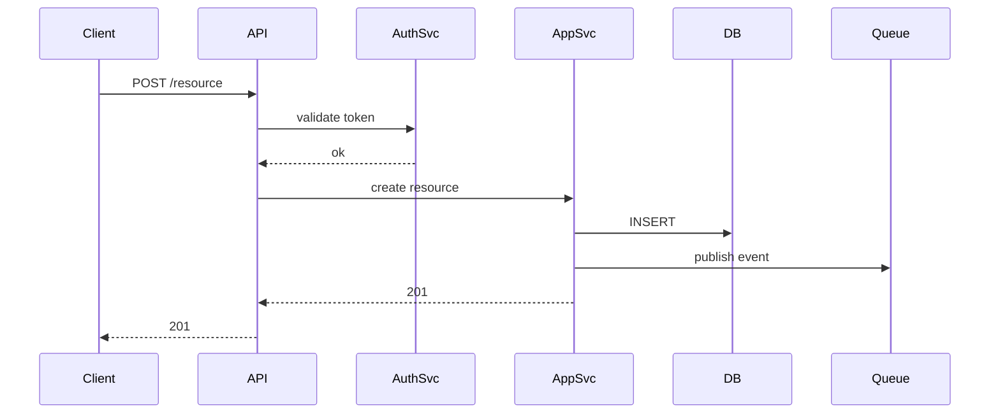

# System Spec Template

```markdown
---
title: {System Name}
type: system
status: draft
author: {author}
created: {YYYY-MM-DD}
related: []
---

# {System Name} Design

## 1. Overview

### 1.1 Purpose / Background
### 1.2 Goals / Non-Goals
### 1.3 Stakeholders
### 1.4 Glossary

## 2. Architecture

### 2.1 Overall Architecture Diagram
{Component diagram in Mermaid or ASCII}



### 2.2 Component List
| Component | Responsibility | Technology | Scaling Strategy |
|-----------|---------------|------------|------------------|
| API Gateway | Routing / Auth | {tech} | Horizontal |
| App Service | Domain logic | {tech} | Horizontal |
| Database | Persistence | PostgreSQL 16 | Read replicas |

### 2.3 Data Flow
{Main request/event flow as a sequence diagram}



### 2.4 Deployment Configuration
- Environments: dev / staging / prod
- Infrastructure: {AWS / GCP / on-prem}
- CI/CD: {tools / pipeline}

## 3. Technology Rationale

| Area | Chosen | Alternatives | Rationale |
|------|--------|-------------|-----------|
| Language | {} | {} | {} |
| DB | {} | {} | {} |
| Cache | {} | {} | {} |

## 4. Non-Functional Requirements

### 4.1 Performance
- Throughput target / latency target / concurrent connections

### 4.2 Security
- Auth / authorization method
- Network boundaries / VPC configuration
- Secret management
- Audit log

### 4.3 Availability / Fault Tolerance
- SLA / SLO / RTO / RPO
- Redundancy / failover
- Backup strategy

### 4.4 Monitoring / Logging
- Metrics (what to collect)
- Log aggregation (where to send)
- Tracing (distributed tracing)
- Alert design

### 4.5 Scalability
- Projected growth and scaling strategy per layer
- Bottleneck prediction

## 5. Data Design
- Key entities (see data spec for details)
- Data retention / archive policy

## 6. External System Integration
| Integration | Method | Protocol | Failure Behavior |
|-------------|--------|----------|------------------|

## 7. Error Handling / Operational Scenarios

### 7.1 Failure Patterns and Behavior
- DB down: {behavior}
- Cache down: {behavior}
- External API failure: {behavior}
- Network partition: {behavior}

### 7.2 Operational Procedures
- Deployment procedure
- Rollback procedure
- Incident response runbook location

## 8. Security Threat Model
| Threat | Impact | Mitigation |
|--------|--------|------------|
| {e.g., SQL injection} | {data leak} | {ORM / parameterized queries} |

## 9. Cost Estimate
- Estimated infrastructure cost (monthly)
- Projected cost increase at scale

## 10. Risks / Open Questions

## 11. Migration Plan (if replacing an existing system)
- Phased release strategy
- Data migration procedure
- Rollback plan

## 12. Change History
```