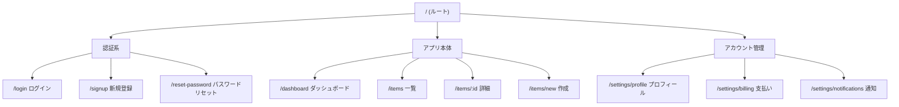

# スタイルガイド生成テンプレート

デザイン初期フェーズで生成するスタイルガイド。
`references/design-tokens.md` のデフォルトトークンをベースに、プロジェクト固有の値を上書きして使う。

---

## ペルソナ定義テンプレート（1〜2体）

各プロジェクトで1〜2体のペルソナを定義する。1体はメインユーザー、2体目は副次ユーザー（存在する場合）。

```markdown
## ペルソナ A: [名前]（メインユーザー）

| 項目 | 内容 |
|------|------|
| 年齢・属性 | 例: 28歳、都市部在住のビジネスパーソン |
| 職業・役割 | 例: スタートアップのプロダクトマネージャー |
| 技術リテラシー | 高 / 中 / 低 |
| 主な利用デバイス | モバイル優先 / デスクトップ優先 / 両方 |
| ゴール | このプロダクトで達成したいこと（1〜3つ） |
| ペインポイント | 現状の課題・不満（1〜3つ） |
| 利用シーン | いつ・どこで・どのように使うか |
| 重視すること | スピード / 安全性 / わかりやすさ / デザイン 等 |

### このペルソナへの設計指針
- UI原則14ヶ条の中で特に優先すべき原則を明記
- 例: 「認知的負荷を軽減（原則8）」「明確な次のステップ（原則14）」
```

```markdown
## ペルソナ B: [名前]（副次ユーザー）※必要な場合のみ

（同フォーマット）
```

---

## サイトマップ テンプレート

情報設計フェーズでサイトマップをMermaidで生成・調整する。



### サイトマップ調整チェック

- [ ] ユーザーのゴールまでのクリック数は最小か（原則3）
- [ ] ナビゲーション構造が一貫しているか（原則5）
- [ ] 各ページの役割が1つに絞られているか（原則3）
- [ ] ペルソナのメインフローが3クリック以内で達成できるか（原則8）

---

## スタイルガイド出力テンプレート

プロジェクト固有の値を記入してスタイルガイドを生成する。

### カラーパレット

```markdown
## Colors

### Brand Colors
| Name       | Hex       | Tailwind Class        | 用途 |
|------------|-----------|----------------------|------|
| Primary    | #2563EB   | bg-primary-600       | CTA、主要アクション |
| Primary Lt | #EFF6FF   | bg-primary-50        | ホバー背景、ハイライト |
| Secondary  | #475569   | bg-secondary-600     | 補助アクション |

### Semantic Colors
| Name     | Hex       | 用途 |
|----------|-----------|------|
| Success  | #16a34a   | 完了・正常状態 |
| Warning  | #d97706   | 注意・警告 |
| Error    | #dc2626   | エラー・危険操作 |
| Info     | #2563eb   | 情報・ヒント |

### Neutral Colors
| Scale | Hex       | 用途 |
|-------|-----------|------|
| 50    | #fafafa   | ページ背景 |
| 100   | #f5f5f5   | セクション背景 |
| 200   | #e5e5e5   | ボーダー（軽） |
| 300   | #d4d4d4   | ボーダー |
| 600   | #525252   | セカンダリテキスト |
| 900   | #171717   | プライマリテキスト |
```

### タイポグラフィ

```markdown
## Typography

### Font Family
- **Heading**: Inter / Noto Sans JP
- **Body**: Inter / Noto Sans JP
- **Code**: JetBrains Mono

### Type Scale
| Role          | Size  | Weight    | Class                    |
|---------------|-------|-----------|--------------------------|
| Page Title    | 36px  | Bold 700  | text-4xl font-bold       |
| Section H2    | 30px  | Semibold  | text-3xl font-semibold   |
| Card H3       | 20px  | Semibold  | text-xl font-semibold    |
| Body          | 16px  | Regular   | text-base font-normal    |
| UI Label      | 14px  | Medium    | text-sm font-medium      |
| Caption       | 12px  | Regular   | text-xs font-normal      |
```

### コンポーネントスタイル

```markdown
## Component Styles

### Button
| Variant  | Class Summary                                    |
|----------|--------------------------------------------------|
| Primary  | bg-primary-600 hover:bg-primary-700 text-white   |
| Secondary| bg-white border border-neutral-300 text-neutral-700|
| Ghost    | hover:bg-neutral-100 text-neutral-700            |
| Danger   | bg-error-600 hover:bg-error-700 text-white       |

### Input
- Border: border-neutral-300
- Focus: focus:ring-1 focus:ring-primary-500 focus:border-primary-500
- Error: border-error-500 focus:ring-error-500

### Card
- Background: bg-white
- Border: border border-neutral-200
- Radius: rounded-lg
- Shadow: shadow-sm
- Padding: p-6

### Spacing Scale（主要）
- コンポーネント内パディング: p-4 (16px)
- セクション間マージン: mt-8 (32px)
- カードグリッドギャップ: gap-6 (24px)
- フォームフィールド間: space-y-4 (16px)
```

### アニメーション・インタラクション

```markdown
## Motion

- **Hover/Focus変化**: transition-colors duration-150
- **モーダル出現**: fade-in + zoom-in-95 (200ms)
- **トースト**: slide-in-from-right (300ms)
- **ページ遷移**: fade (150ms)

原則: アニメーションはユーザーの注意を「補助」するために使う。装飾目的のアニメーションは排除。
```

---

## スタイルガイド生成時の確認事項

1. ペルソナのデバイス傾向に合わせてブレークポイント戦略を決める
2. ブランドカラーが WCAG AA のコントラスト基準を満たすか確認
3. 使用フォントが日本語対応している場合、`Noto Sans JP` を追加する
4. tailwind.config.js に反映するトークンをリストアップしておく
