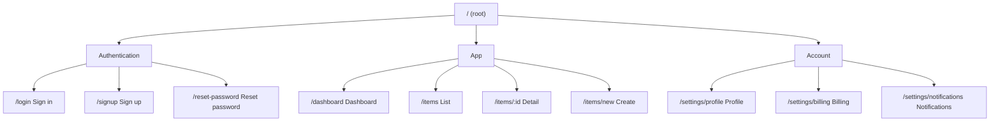

# Style Guide Generation Templates

Style guides produced in the early design phase.
Base them on default tokens from `references/design-tokens.md` and override with project-specific values.

---

## Persona Definition Template (1–2 personas)

Define 1–2 personas per project. One is the primary user; the second is a secondary user when needed.

```markdown
## Persona A: [Name] (Primary User)

| Field | Content |
|-------|---------|
| Age / Profile | e.g., 28, urban business professional |
| Role | e.g., startup product manager |
| Tech literacy | High / Medium / Low |
| Primary device | Mobile-first / Desktop-first / Both |
| Goals | What they want to achieve with this product (1–3 items) |
| Pain points | Current frustrations or blockers (1–3 items) |
| Usage context | When, where, and how they use it |
| Priorities | Speed / Safety / Clarity / Design, etc. |

### Design Guidelines for This Persona
- Note which of the 14 UI principles to prioritize
- e.g., "Reduce cognitive load (Principle 8)", "Present clear next steps (Principle 14)"
```

```markdown
## Persona B: [Name] (Secondary User) — only when needed

(Same format)
```

---

## Sitemap Template

Generate and refine the sitemap with Mermaid during information architecture.



### Sitemap Review Checklist

- [ ] Clicks to user goals are minimized (Principle 3)
- [ ] Navigation structure is consistent (Principle 5)
- [ ] Each page has a single clear role (Principle 3)
- [ ] Persona main flows are reachable within 3 clicks (Principle 8)

---

## Style Guide Output Template

Fill in project-specific values to generate the style guide.

### Color Palette

```markdown
## Colors

### Brand Colors
| Name       | Hex       | Tailwind Class        | Usage |
|------------|-----------|----------------------|-------|
| Primary    | #2563EB   | bg-primary-600       | CTA, primary actions |
| Primary Lt | #EFF6FF   | bg-primary-50        | Hover background, highlights |
| Secondary  | #475569   | bg-secondary-600     | Secondary actions |

### Semantic Colors
| Name     | Hex       | Usage |
|----------|-----------|-------|
| Success  | #16a34a   | Complete, normal state |
| Warning  | #d97706   | Caution, warning |
| Error    | #dc2626   | Error, destructive action |
| Info     | #2563eb   | Information, hint |

### Neutral Colors
| Scale | Hex       | Usage |
|-------|-----------|-------|
| 50    | #fafafa   | Page background |
| 100   | #f5f5f5   | Section background |
| 200   | #e5e5e5   | Border (light) |
| 300   | #d4d4d4   | Border |
| 600   | #525252   | Secondary text |
| 900   | #171717   | Primary text |
```

### Typography

```markdown
## Typography

### Font Family
- **Heading**: Inter / Noto Sans JP
- **Body**: Inter / Noto Sans JP
- **Code**: JetBrains Mono

### Type Scale
| Role          | Size  | Weight    | Class                    |
|---------------|-------|-----------|--------------------------|
| Page Title    | 36px  | Bold 700  | text-4xl font-bold       |
| Section H2    | 30px  | Semibold  | text-3xl font-semibold   |
| Card H3       | 20px  | Semibold  | text-xl font-semibold    |
| Body          | 16px  | Regular   | text-base font-normal    |
| UI Label      | 14px  | Medium    | text-sm font-medium      |
| Caption       | 12px  | Regular   | text-xs font-normal      |
```

### Component Styles

```markdown
## Component Styles

### Button
| Variant  | Class Summary                                    |
|----------|--------------------------------------------------|
| Primary  | bg-primary-600 hover:bg-primary-700 text-white   |
| Secondary| bg-white border border-neutral-300 text-neutral-700|
| Ghost    | hover:bg-neutral-100 text-neutral-700            |
| Danger   | bg-error-600 hover:bg-error-700 text-white       |

### Input
- Border: border-neutral-300
- Focus: focus:ring-1 focus:ring-primary-500 focus:border-primary-500
- Error: border-error-500 focus:ring-error-500

### Card
- Background: bg-white
- Border: border border-neutral-200
- Radius: rounded-lg
- Shadow: shadow-sm
- Padding: p-6

### Spacing Scale (key)
- Component padding: p-4 (16px)
- Section margin: mt-8 (32px)
- Card grid gap: gap-6 (24px)
- Form field spacing: space-y-4 (16px)
```

### Animation and Interaction

```markdown
## Motion

- **Hover/focus changes**: transition-colors duration-150
- **Modal enter**: fade-in + zoom-in-95 (200ms)
- **Toast**: slide-in-from-right (300ms)
- **Page transition**: fade (150ms)

Principle: Use animation to support user attention, not as decoration.
```

---

## Style Guide Generation Checklist

1. Set breakpoint strategy based on persona device preferences
2. Confirm brand colors meet WCAG AA contrast requirements
3. Add `Noto Sans JP` when supporting Japanese text
4. List tokens to reflect in `tailwind.config.js`
